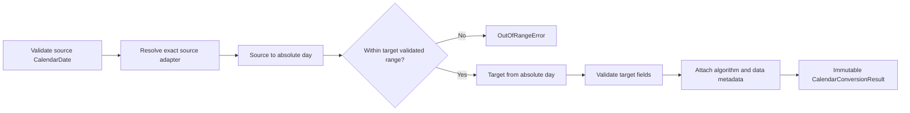
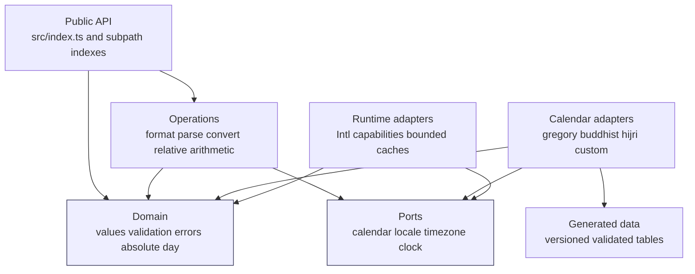
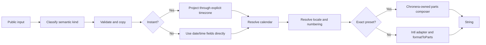
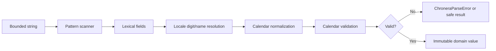
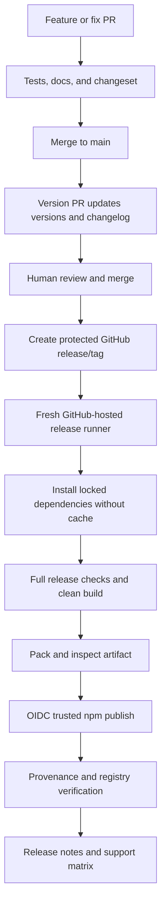

# Chronera

[](https://github.com/INTECH-Software-House/chronera-js/actions/workflows/ci.yml)
[](https://github.com/INTECH-Software-House/chronera-js/actions/workflows/security.yml)
[](https://securityscorecards.dev/viewer/?run=github.com/INTECH-Software-House/chronera-js)
[](package.json)
[](LICENSE)
[](CONTRIBUTING.md)
[](tsconfig.json)
[](prettier.config.js)

> A universal, type-safe date, time, calendar, era, locale, and timezone toolkit for JavaScript and TypeScript.

- Architecture specification: Draft 0.1.
- Implementation status: Pre-1.0; the repository is at the architecture stage and the API is subject to change.
- Repository identity: `intech/chronera-js`.
- Provisional npm identity: `@intech-software/chronera`.

Chronera is the JavaScript and TypeScript implementation of the Chronera ecosystem.
It is designed as infrastructure for applications that need explicit date semantics,
multiple calendar systems,
era-aware representation,
locale-sensitive formatting,
strict parsing,
numbering systems,
and timezone-aware projection.

This document is both the package README and the governing engineering specification.
It defines the product contract before implementation begins.
Statements using **MUST**, **MUST NOT**, **SHOULD**, **SHOULD NOT**, and **MAY** are normative in the RFC 2119 sense.

The official package scope `@intech-software` is owned and controlled by the project on npmjs.com.
All examples use `@intech-software/chronera` consistently.

> [!IMPORTANT]
> No package has been published by this specification alone.
> Installation commands become executable only after the first verified release.
> Support claims become active only when the corresponding release matrix is green.

## Table of contents

- [Project overview](#project-overview)
- [Quick start](#quick-start)
- [Installation](#installation)
- [Status and compatibility contract](#status-and-compatibility-contract)
- [Goals](#goals)
- [Non-goals](#non-goals)
- [Design principles](#design-principles)
- [Conceptual model](#conceptual-model)
  - [Date and time vocabulary](#date-and-time-vocabulary)
  - [Input taxonomy](#input-taxonomy)
  - [Output taxonomy](#output-taxonomy)
  - [Persistence and serialization](#persistence-and-serialization)
- [API index](#api-index)
- [Public type model](#public-type-model)
- [Defaults and option precedence](#defaults-and-option-precedence)
- [Formatting](#formatting)
  - [Date formatting](#date-formatting)
  - [Time and date-time formatting](#time-and-date-time-formatting)
  - [Pattern formatting](#pattern-formatting)
  - [Format presets](#format-presets)
  - [Date ranges](#date-ranges)
  - [Output stability](#output-stability)
- [Parsing](#parsing)
  - [Strict parser pipeline](#strict-parser-pipeline)
  - [Pattern grammar](#pattern-grammar)
  - [Safe parsing](#safe-parsing)
  - [Input limits and Unicode](#input-limits-and-unicode)
- [Calendar conversion](#calendar-conversion)
- [Calendar systems](#calendar-systems)
  - [Calendar capability matrix](#calendar-capability-matrix)
  - [Gregorian and ISO 8601](#gregorian-and-iso-8601)
  - [Buddhist calendar and Buddhist Era](#buddhist-calendar-and-buddhist-era)
  - [Hijri calendars](#hijri-calendars)
  - [Japanese eras](#japanese-eras)
  - [Other planned calendars](#other-planned-calendars)
- [Era and year numbering](#era-and-year-numbering)
- [Locale and numbering systems](#locale-and-numbering-systems)
- [Timezone model](#timezone-model)
- [Relative time, durations, and arithmetic](#relative-time-durations-and-arithmetic)
- [Validation and errors](#validation-and-errors)
- [Intl strategy](#intl-strategy)
- [Temporal strategy](#temporal-strategy)
- [Determinism contract](#determinism-contract)
- [Architecture](#architecture)
  - [Architecture decisions](#architecture-decisions)
  - [Dependency rules](#dependency-rules)
  - [Operation flows](#operation-flows)
  - [Calendar adapter model](#calendar-adapter-model)
  - [Runtime adapters and caches](#runtime-adapters-and-caches)
- [Repository structure](#repository-structure)
- [Representative implementation](#representative-implementation)
- [TypeScript engineering standard](#typescript-engineering-standard)
- [JavaScript consumer experience](#javascript-consumer-experience)
- [Framework examples](#framework-examples)
- [Package architecture](#package-architecture)
  - [Module decision](#module-decision)
  - [Package metadata](#package-metadata)
  - [Export map](#export-map)
  - [Build output](#build-output)
  - [Tarball contract](#tarball-contract)
- [Development workflow](#development-workflow)
- [Clean code standard](#clean-code-standard)
- [Testing strategy](#testing-strategy)
- [Security and privacy](#security-and-privacy)
- [Performance and bundle discipline](#performance-and-bundle-discipline)
- [CI and compatibility](#ci-and-compatibility)
- [Release engineering](#release-engineering)
- [Versioning and compatibility](#versioning-and-compatibility)
- [Contribution and governance](#contribution-and-governance)
- [Calendar evidence and data governance](#calendar-evidence-and-data-governance)
- [Roadmap](#roadmap)
- [Implementation phases](#implementation-phases)
- [Production-readiness checklist](#production-readiness-checklist)
- [1.0-readiness checklist](#10-readiness-checklist)
- [Architectural invariants](#architectural-invariants)
- [FAQ](#faq)
- [Alternatives](#alternatives)
- [Future Chronera ecosystem](#future-chronera-ecosystem)
- [License decision](#license-decision)
- [Authoritative references](#authoritative-references)

## Project overview

Chronera provides one coherent model for operations that are often incorrectly collapsed into JavaScript `Date` manipulation.
Its public API separates date-only values from instants,
calendars from eras,
locales from numbering systems,
and timezones from UTC offsets.

Chronera is implemented in strict TypeScript.
The npm package contains JavaScript output and bundled declaration files.
JavaScript and TypeScript consumers install the same package.
There is no separate JavaScript build,
no `@types/chronera` package,
and no framework-specific core.

The project targets the following capabilities over its staged roadmap:

- localized date formatting;
- localized time formatting;
- localized date-time formatting;
- deterministic machine-oriented formatting;
- strict date parsing;
- safe result-oriented parsing;
- structured calendar conversion;
- era representation;
- calendar-specific validation;
- locale negotiation;
- numbering-system selection;
- timezone-aware projection of instants;
- date-range formatting;
- relative-time formatting;
- duration representation;
- explicit calendar arithmetic;
- capability inspection;
- custom calendar adapters through configured instances.

“Production-grade” is a release criterion,
not a marketing adjective.
For Chronera it means verified calendar data,
defined valid ranges,
consumer-tested package artifacts,
strict public types,
bounded resource use,
secure publishing,
stable compatibility rules,
and documented correction procedures.

It does not mean controller/service/repository layers,
dependency-injection containers,
class hierarchies,
or process-heavy ceremony.

## Quick start

The examples below describe the target public API.
They become runnable when the corresponding feature is released.

### JavaScript

```js
import { formatDate, parseLocalDate } from "@intech-software/chronera";

const date = parseLocalDate("2026-09-02");

const output = formatDate(date, {
  locale: "th-TH",
  calendar: "buddhist",
  style: "long",
});

console.log(output);
```

Runtime-native Thai formatting is locale-data-dependent.
For the fixed input above,
an environment with the expected ICU data commonly produces `2 กันยายน 2569`.
Chronera does not classify that native output as an exact-string guarantee.

### TypeScript

```ts
import { convertCalendarDate, parseLocalDate } from "@intech-software/chronera";
import type {
  CalendarConversionResult,
  LocalDate,
} from "@intech-software/chronera";

const gregorian: LocalDate = parseLocalDate("2026-09-02");

const buddhist: CalendarConversionResult = convertCalendarDate(
  {
    kind: "calendar-date",
    calendar: "gregory",
    year: gregorian.year,
    monthCode: `M${String(gregorian.month).padStart(2, "0")}`,
    day: gregorian.day,
  },
  "buddhist",
);

console.log(buddhist.value.year); // 2569
console.log(buddhist.metadata.deterministic); // true
```

### Instant projection

```ts
import {
  formatDateTime,
  instantFromEpochMilliseconds,
} from "@intech-software/chronera";

const instant = instantFromEpochMilliseconds(
  Date.parse("2026-09-02T06:45:00Z"),
);

const output = formatDateTime(instant, {
  locale: "en-GB",
  calendar: "gregory",
  timeZone: "Asia/Bangkok",
  dateStyle: "long",
  timeStyle: "short",
});

console.log(output);
```

The timestamp is an instant.
`Asia/Bangkok` determines the local clock fields used for display.
Changing the timezone changes the representation,
not the instant.

## Installation

The same npm-compatible artifact is consumed by all supported package managers.
Chronera does not maintain package-manager-specific implementations.

| Package manager | Consumer command                        |
| --------------- | --------------------------------------- |
| npm             | `npm install @intech-software/chronera` |
| pnpm            | `pnpm add @intech-software/chronera`    |
| Yarn            | `yarn add @intech-software/chronera`    |
| Bun             | `bun add @intech-software/chronera`     |

The repository uses pnpm for contributor workflows.
That choice does not require consumers to use pnpm.
The published tarball,
its standard npm metadata,
and its export map determine consumer compatibility.

No install command should be presented as functional before a release exists.
The first release checklist includes a clean-registry installation test.

## Status and compatibility contract

### Current status

This README is an implementation blueprint.
At this stage no runtime or calendar capability is claimed as shipped.
Each release MUST publish a generated support matrix in its release notes.
A capability is supported only when its conformance and consumer jobs pass for that release.

### Runtime policy

The initial implementation baseline is:

| Environment             | Initial policy                            | Required evidence                                  |
| ----------------------- | ----------------------------------------- | -------------------------------------------------- |
| Node.js 22.14 or later  | Targeted                                  | minimum-version CI and current LTS CI              |
| Node.js Active LTS      | Targeted                                  | full CI                                            |
| Node.js Current         | Provisional                               | compatibility CI; failures assessed before release |
| Bun current stable      | Targeted                                  | native runtime and package-install tests           |
| Chromium current stable | Targeted                                  | browser integration tests                          |
| Firefox current stable  | Targeted                                  | browser integration tests                          |
| WebKit current stable   | Targeted                                  | browser integration tests                          |
| Next.js SSR             | Targeted through standards APIs           | server fixture test                                |
| Edge-like runtimes      | Capability-dependent                      | explicit runtime fixture before support claim      |
| Deno                    | Not initially supported                   | no claim until dedicated CI exists                 |
| CommonJS `require`      | Not supported in the initial architecture | deliberate ESM-only decision                       |
| Yarn Plug'n'Play        | Provisional                               | packed-tarball PnP consumer test                   |

Node.js production support follows maintained LTS lines.
When the minimum line reaches end of life,
Chronera may raise the floor in a SemVer-major release,
or in a documented SemVer-minor release before `1.0.0`.
The concrete package example uses `>=22.14.0` because it is a maintained baseline at the date of this specification and aligns with the minimum Node version documented for npm trusted publishing workflows.

Browser support is capability-based rather than user-agent-based.
Chronera tests current stable Chromium,
Firefox,
and WebKit releases.
It does not promise every embedded WebView or every ICU dataset.
Runtime-native formatting may vary even when JavaScript syntax is supported.

### Source and runtime compatibility

Source compatibility means a consumer can type-check against Chronera's declarations.
Runtime compatibility means the emitted JavaScript and required platform APIs work in that environment.
Package compatibility means the package manager resolves the tarball and exports correctly.
These are separate claims and receive separate tests.

### Badges

Useful badges after infrastructure exists are:

- CI status;
- npm version;
- Apache-2.0 license;
- coverage trend;
- package provenance.

Badge URLs are intentionally absent until the repository,
workflows,
coverage project,
and package are live.
Decorative badge clutter is not part of the documentation standard.

## Goals

Chronera MUST:

- make ambiguous date concepts explicit;
- treat JavaScript users as first-class consumers;
- give TypeScript users precise inference and declarations;
- keep calendar and era semantics separate;
- keep locale and calendar selection separate;
- keep timezone and offset semantics separate;
- distinguish date-only values from instants;
- support international use without a Thailand-first core;
- make Thai Buddhist behavior first-class through ordinary extension points;
- make Hijri variants explicit and independently documented;
- expose whether a result is deterministic;
- provide stable parsing for documented grammars;
- reject invalid dates instead of allowing JavaScript rollover;
- avoid hidden environment-dependent defaults where correctness is affected;
- ship no runtime dependency by default;
- remain framework-neutral;
- remain safe to import in browsers,
  servers,
  SSR,
  and worker-like environments with required APIs;
- publish only reviewed exports;
- test the packed npm artifact as the product;
- build and publish in CI with verifiable provenance;
- maintain language-neutral conformance fixtures where possible.

Chronera SHOULD:

- use native standards when they correctly solve a problem;
- own algorithms or data only where stable semantics require it;
- preserve synchronous APIs for local computation;
- keep cold-start and bundle costs visible;
- prefer functions and immutable records over stateful classes;
- permit custom calendar adapters without global registration;
- keep error messages useful to developers;
- document every supported range and algorithm source.

## Non-goals

Chronera is not:

- a UI date picker;
- a calendar widget;
- a React component library;
- a Vue plugin;
- a Svelte component set;
- a Next.js integration package;
- a scheduling server;
- a cron engine;
- an NTP client;
- a timezone database distributor;
- an ORM;
- a database abstraction;
- a replacement for database timezone types;
- a generic translation framework;
- a generic numeral-conversion toolkit;
- an astronomical ephemeris;
- a moon-sighting service;
- a religious authority;
- a mechanism for guessing ambiguous user dates;
- a global polyfill bundle;
- a monkey patch for `Date` or `Intl`;
- a network service;
- a telemetry SDK.

Chronera will not add framework adapters merely to demonstrate compatibility.
Framework examples use ordinary package imports.
Dedicated adapters require proven framework-specific semantics that cannot be expressed through the core.

## Design principles

Priority order:

1. calendrical and temporal correctness;
2. explicit and predictable semantics;
3. maintainability;
4. consumer experience;
5. compatibility;
6. security and reproducibility;
7. measured performance;
8. convenience.

The project applies the following rules:

- Correctness outranks cleverness.
- A requested calendar is never silently replaced.
- A requested timezone is never reinterpreted as a fixed offset.
- A localized display string is never presented as a machine serialization format.
- Runtime-dependent behavior is labeled runtime-dependent.
- Exact output is promised only when Chronera owns every relevant rule and datum.
- Public operations never mutate caller-owned inputs.
- Core operations never read files,
  contact networks,
  inspect `node_modules`,
  or access DOM globals.
- Imports perform no heavy eager initialization.
- No public call treats `null`,
  `undefined`,
  or an omitted required value as “now.”
- Defaults are documented and invariant across machines where practical.
- Strict parsing is the default.
- Unsupported capabilities fail with typed errors.
- Extension occurs through explicit configured values,
  not process-wide registries.
- One package serves JavaScript and TypeScript.
- One package serves npm,
  pnpm,
  Yarn,
  and Bun consumers.
- The npm tarball is the product;
  the repository working tree is not the consumer contract.

### KISS, YAGNI, and DRY

KISS means using the smallest architecture that preserves correctness and extension seams.
It does not justify collapsing all date concepts into `Date`.

YAGNI means that planned calendars do not ship half-implemented adapters.
The public registry shape can accommodate a future adapter without implementing speculative calendar logic today.

DRY applies to knowledge.
Two syntactically similar algorithms remain separate when they express different calendar rules.
Shared validation is extracted only when the invariant is genuinely identical.
There is no generic `utils.ts` or `helpers.ts` dumping ground.

### SOLID for a functional library

- Single responsibility is enforced through cohesive modules and operations.
- Open/closed behavior is provided by capability-based calendar adapters.
- Liskov substitution applies only to contracts with truly shared semantics.
- Interface segregation produces focused conversion,
  validation,
  and arithmetic capabilities.
- Dependency inversion places `Intl`,
  runtime clocks,
  and custom calendars behind explicit adapters.

Chronera does not translate SOLID into a class per noun.
Composition is preferred to inheritance.
There is no `BaseCalendar -> GregorianCalendar -> BuddhistCalendar` hierarchy.

## Conceptual model

### Date and time vocabulary

| Concept            | Meaning in Chronera                                        | Example                                     | Not equivalent to        |
| ------------------ | ---------------------------------------------------------- | ------------------------------------------- | ------------------------ |
| Instant            | A point on the UTC timeline                                | `2026-09-02T06:45:00Z`                      | local date-time          |
| Epoch milliseconds | Numeric representation of an instant                       | `Date.parse("2026-09-02T06:45:00Z")` result | calendar fields          |
| Local date         | Year, month, and day without timezone or clock             | `2026-09-02`                                | midnight UTC             |
| Local time         | Clock fields without date or timezone                      | `13:45:00`                                  | elapsed duration         |
| Local date-time    | Local date and local time without an offset                | `2026-09-02T13:45:00`                       | instant                  |
| Calendar date      | Date fields interpreted in a named calendar                | Buddhist year 2569, month 9, day 2          | localized string         |
| Zoned date-time    | An instant projected through an IANA timezone and calendar | Bangkok representation of an instant        | fixed UTC offset         |
| Timezone           | A named ruleset whose offsets may change                   | `America/New_York`                          | `-04:00`                 |
| Offset             | Difference from UTC at one instant                         | `+07:00`                                    | `Asia/Bangkok` identity  |
| Calendar           | Rules mapping day positions to fields                      | `gregory`, `buddhist`                       | locale                   |
| Era                | Named period used to interpret or label years              | `CE`, `BE`, `AH`, `Reiwa`                   | calendar identifier      |
| Locale             | Language and regional presentation preferences             | `th-TH`                                     | calendar choice          |
| Numbering system   | Digit repertoire used for output/input                     | `latn`, `thai`, `arab`                      | language                 |
| Duration           | Amount measured in units                                   | 24 hours                                    | one local day across DST |
| Date range         | Ordered pair with inclusion semantics                      | 1–5 September                               | duration                 |

These distinctions are foundational.
APIs that cross a boundary name the required context.

### Instant

A JavaScript `Date` is accepted only at instant-oriented boundaries.
Chronera reads `date.getTime()` after validating it.
It never treats a `Date` as a timezone-aware object;
the object stores no IANA timezone.
It never mutates the input `Date`.

Initial product range:

| Value                      | Inclusive bound            |
| -------------------------- | -------------------------- |
| minimum instant            | `0001-01-01T00:00:00.000Z` |
| maximum instant            | `9999-12-31T23:59:59.999Z` |
| minimum epoch milliseconds | `-62135596800000`          |
| maximum epoch milliseconds | `253402300799999`          |

Epoch milliseconds must be finite integers within these bounds.
Chronera intentionally supports less than JavaScript `Date`'s full range.
Timezone projection that falls outside the supported local-date range throws `CHRONERA_OUT_OF_RANGE`.
Sub-millisecond instants require an explicit future representation rather than silent precision loss.

### Local date

`2026-09-02` is interpreted as a date-only value by `parseLocalDate`.
It is not passed through `new Date("2026-09-02")`.
No UTC conversion occurs.
This prevents west-of-UTC or east-of-UTC date rollover surprises.

### Calendar date

A calendar date contains a calendar identifier and calendar-native fields.
Its `monthCode` supports calendars where a leap month cannot be represented by the integer range 1–12 alone.
An optional numeric `month` is a convenience only when the adapter guarantees an unambiguous ordinal.

### Zoned projection

Projecting an instant requires a timezone.
The timezone selects local fields for that point in history.
The calendar selects how the local date is represented.
The locale selects names and ordering.
The numbering system selects digits.
No one option implies another.

### Input taxonomy

| Public input                      | Accepted by                                 | Interpretation                                 |
| --------------------------------- | ------------------------------------------- | ---------------------------------------------- |
| `Date`                            | instant formatting and instant constructors | validated epoch milliseconds                   |
| finite integer epoch milliseconds | instant constructors                        | point on UTC timeline                          |
| `Instant`                         | instant formatting and comparison           | point on UTC timeline                          |
| ISO date string                   | `parseLocalDate` only                       | Gregorian local date                           |
| RFC 3339 timestamp with offset    | `parseInstant` only                         | instant                                        |
| `LocalDate`                       | date-only formatting and conversion entry   | proleptic Gregorian fields                     |
| `LocalTime`                       | time-only formatting                        | wall-clock fields                              |
| `LocalDateTime`                   | explicit local resolution APIs              | unresolved wall-clock value                    |
| `CalendarDate`                    | calendar formatting and conversion          | fields in named calendar                       |
| arbitrary string                  | strict parsing APIs                         | grammar supplied by API/options                |
| Temporal value                    | future optional adapter                     | explicitly converted, never duck-typed in core |

Generic functions do not accept arbitrary “date-like” objects.
Duck typing would make validation and error reporting unpredictable.

### Output taxonomy

| Output                     | Purpose                                   | Stability                                            |
| -------------------------- | ----------------------------------------- | ---------------------------------------------------- |
| localized string           | human display                             | runtime-native unless a stable preset says otherwise |
| `Instant`                  | timeline computation                      | exact within numeric range                           |
| `LocalDate`                | date-only application data                | exact                                                |
| `CalendarDate`             | structured calendar representation        | algorithm contract applies                           |
| `CalendarConversionResult` | value plus engine metadata                | metadata is part of public contract                  |
| `SafeParseResult<T>`       | non-throwing validation boundary          | exact discriminated union                            |
| `ChroneraError`            | developer diagnostic                      | stable code; message may improve compatibly          |
| capabilities record        | runtime and configured feature inspection | exact schema; values reflect environment             |

### Persistence and serialization

Persist semantic values,
not their presentation.

Recommended instant persistence:

```text
2026-09-02T06:45:00Z
```

Recommended date-only persistence:

```text
2026-09-02
```

Recommended structured non-Gregorian persistence when the original calendar matters:

```json
{
  "calendar": "buddhist",
  "era": "BE",
  "year": 2569,
  "monthCode": "M09",
  "day": 2,
  "reference": "2026-09-02"
}
```

The exact application schema is an application decision.
The `reference` field above is a Gregorian date-only anchor,
not an instant.

Do not store `วันที่ 2 กันยายน พ.ศ. 2569` as a canonical database date.
It is localized presentation text.
Do not label `2569-09-02` an ISO date.
ISO 8601 calendar year 2569 and Buddhist Era year 2569 are different meanings even when the digits look structurally similar.

Chronera does not own database migrations,
column types,
or ORM behavior.
Applications remain responsible for preserving their intended semantics.

## API index

The initial public surface is intentionally smaller than the internal architecture.
Only exports listed here and exposed by `package.json#exports` are supported.
Signature-only TypeScript fences are declaration-file excerpts, not runnable modules.
Consumer examples and representative implementation modules are labeled separately.

### Construction and normalization

| Export                         | Purpose                                           | Failure behavior                                 |
| ------------------------------ | ------------------------------------------------- | ------------------------------------------------ |
| `instantFromEpochMilliseconds` | Construct an immutable `Instant`                  | throws on non-integer or out-of-range input      |
| `instantFromDate`              | Copy the instant represented by a valid `Date`    | throws on invalid `Date`                         |
| `localDate`                    | Validate and construct Gregorian date-only fields | throws on invalid fields                         |
| `localTime`                    | Validate and construct wall-clock fields          | throws on invalid fields                         |
| `calendarDate`                 | Validate through a calendar adapter               | throws on unavailable calendar or invalid fields |

### Parsing

| Export               | Purpose                                       | Failure behavior                     |
| -------------------- | --------------------------------------------- | ------------------------------------ |
| `parseLocalDate`     | Parse ISO date syntax or an explicit pattern  | throws `ChroneraParseError`          |
| `safeParseLocalDate` | Non-throwing local-date parse                 | returns `SafeParseResult<LocalDate>` |
| `parseInstant`       | Parse RFC 3339 timestamp with required offset | throws `ChroneraParseError`          |
| `safeParseInstant`   | Non-throwing instant parse                    | returns `SafeParseResult<Instant>`   |

### Formatting

| Export              | Purpose                                        | Output class                                       |
| ------------------- | ---------------------------------------------- | -------------------------------------------------- |
| `formatDate`        | Format a date-only value or instant projection | native or exact preset                             |
| `formatTime`        | Format a local time or instant projection      | runtime-native                                     |
| `formatDateTime`    | Format an instant or explicit local date-time  | runtime-native                                     |
| `formatDateRange`   | Format an ordered date range                   | runtime-native or documented fallback              |
| `formatWithPattern` | Format with Chronera token grammar             | exact for numeric tokens; data-dependent for names |
| `formatRelative`    | Format relative to an explicit reference       | runtime-native wording                             |

### Calendars and validation

| Export                    | Purpose                             | Result                        |
| ------------------------- | ----------------------------------- | ----------------------------- |
| `convertCalendarDate`     | Convert a date-only representation  | structured value and metadata |
| `isValidCalendarDate`     | Validate without throwing           | boolean                       |
| `daysInMonth`             | Query adapter-specific month length | integer                       |
| `isLeapYear`              | Query adapter-specific leap rule    | boolean                       |
| `getCalendarCapabilities` | Inspect one configured calendar     | immutable record              |
| `getRuntimeCapabilities`  | Inspect `Intl` and timezone support | immutable record              |

### Configuration and comparison

| Export              | Purpose                                | Notes                              |
| ------------------- | -------------------------------------- | ---------------------------------- |
| `createChronera`    | Create an immutable configured API     | accepts custom adapters explicitly |
| `compareInstants`   | Timeline ordering                      | returns `-1`, `0`, or `1`          |
| `compareLocalDates` | Proleptic Gregorian date ordering      | no timezone                        |
| `sameCalendarDate`  | Same calendar and same calendar fields | does not convert                   |
| `sameAbsoluteDate`  | Compare convertible calendar dates     | requires deterministic converters  |

The initial root API does not export:

- a generic `format` function;
- a generic `parse` function;
- a default export;
- a mutable singleton;
- an arbitrary digit converter;
- compiled formatter or parser objects;
- internal absolute-day arithmetic;
- runtime `Intl` adapters;
- generated datasets.

Generic names hide critical input semantics.
Compilation APIs remain internal until benchmarks prove a public use case.

## Public type model

Public records are structurally typed,
readonly,
and carry a discriminant where values could otherwise be confused.
Objects are not frozen recursively by default because deep freezing adds cost and does not create compile-time safety for JavaScript.
Chronera never retains a mutable reference to caller-owned nested options.

```ts
export type BuiltInCalendarId =
  | "iso8601"
  | "gregory"
  | "buddhist"
  | "islamic"
  | "islamic-civil"
  | "islamic-tbla"
  | "islamic-umalqura"
  | "persian"
  | "hebrew"
  | "japanese"
  | "roc"
  | "indian"
  | "coptic"
  | "ethiopic"
  | "chinese"
  | "dangi";

type ExtensibleIdentifier = string & Record<never, never>;

export type CalendarId = BuiltInCalendarId | ExtensibleIdentifier;

export type LocaleId = string;
export type TimeZoneId = string;
export type NumberingSystemId = string;
export type EraId = string;
export type MonthCode = `M${string}`;
```

The built-in union provides autocomplete.
The extensible string branch permits standards additions and configured calendars without forcing a Chronera major release.
Runtime validation remains authoritative.
TypeScript acceptance of a string is not proof that the runtime supports it.

```ts
export interface Instant {
  readonly kind: "instant";
  readonly epochMilliseconds: number;
}

export interface LocalDate {
  readonly kind: "local-date";
  readonly year: number;
  readonly month: number;
  readonly day: number;
}

export interface LocalTime {
  readonly kind: "local-time";
  readonly hour: number;
  readonly minute: number;
  readonly second: number;
  readonly millisecond: number;
}

export interface LocalDateTime {
  readonly kind: "local-date-time";
  readonly date: LocalDate;
  readonly time: LocalTime;
}

export interface CalendarDate {
  readonly kind: "calendar-date";
  readonly calendar: CalendarId;
  readonly era?: EraId;
  readonly eraYear?: number;
  readonly year: number;
  readonly monthCode: MonthCode;
  readonly month?: number;
  readonly day: number;
}

export interface ZonedDateTime {
  readonly kind: "zoned-date-time";
  readonly instant: Instant;
  readonly timeZone: TimeZoneId;
  readonly calendar: CalendarId;
}

export type FormatDateInput = LocalDate | CalendarDate | Instant | Date;
```

`year` uses the adapter's documented extended-year numbering.
`era` and `eraYear` are present when an era representation is requested or required.
Consumers MUST NOT derive `eraYear` from `year` without the adapter's era rules.

```ts
export interface Duration {
  readonly years?: number;
  readonly months?: number;
  readonly weeks?: number;
  readonly days?: number;
  readonly hours?: number;
  readonly minutes?: number;
  readonly seconds?: number;
  readonly milliseconds?: number;
}

export interface DateRange<TDate> {
  readonly start: TDate;
  readonly end: TDate;
  readonly startInclusive: boolean;
  readonly endInclusive: boolean;
}

export interface CalendarConversionMetadata {
  readonly requestedCalendar: CalendarId;
  readonly resolvedCalendar: CalendarId;
  readonly engine: "chronera" | "runtime-intl" | "custom";
  readonly algorithm: string;
  readonly deterministic: boolean;
  readonly dataVersion?: string;
  readonly validFrom?: LocalDate;
  readonly validTo?: LocalDate;
}

export interface CalendarConversionResult {
  readonly value: CalendarDate;
  readonly metadata: CalendarConversionMetadata;
}
```

Metadata is not decorative.
It makes the requested calendar variant,
engine,
algorithm,
data version,
and determinism visible to callers.
A conversion must never report `resolvedCalendar` different from `requestedCalendar` unless the caller selected an explicit fallback policy and the result records that policy.

```ts
export interface ChroneraIssue {
  readonly code: ChroneraErrorCode;
  readonly message: string;
  readonly path?: readonly (string | number)[];
}

export type SafeParseResult<T> =
  | {
      readonly success: true;
      readonly value: T;
    }
  | {
      readonly success: false;
      readonly error: ChroneraIssue;
    };
```

The safe result is a small discriminated union.
Chronera does not add a runtime Result dependency.

### Branded strings

Chronera does not expose a brand for every string.
Brands are useful only after runtime validation.
The initial API MAY return these validated brands from dedicated parsers:

```ts
declare const ISO_DATE_BRAND: unique symbol;
declare const RFC3339_INSTANT_BRAND: unique symbol;

export type IsoDateString = string & {
  readonly [ISO_DATE_BRAND]: true;
};

export type Rfc3339InstantString = string & {
  readonly [RFC3339_INSTANT_BRAND]: true;
};
```

Consumers cannot create a trustworthy branded value through a type assertion alone.
Chronera APIs still validate at runtime when values cross an unsafe boundary.

### Equality

Equality names encode the compared concept:

- `compareInstants` compares timeline positions;
- `compareLocalDates` compares Gregorian date-only fields;
- `sameCalendarDate` requires identical calendar IDs and fields;
- `sameAbsoluteDate` converts both values to the internal absolute-day representation;
- object identity is never meaningful date equality.

No ambiguous `equals` export exists.
No sorting helper exists because callers can use comparison functions with native array methods.

```ts
export type Comparison = -1 | 0 | 1;

export function compareInstants(left: Instant, right: Instant): Comparison;

export function compareLocalDates(
  left: LocalDate,
  right: LocalDate,
): Comparison;

export function sameCalendarDate(
  left: CalendarDate,
  right: CalendarDate,
): boolean;

export function sameAbsoluteDate(
  left: CalendarDate,
  right: CalendarDate,
): boolean;
```

## Defaults and option precedence

Defaults are intentionally conservative.

| Option                            | Functional default                    | Rationale                                     |
| --------------------------------- | ------------------------------------- | --------------------------------------------- |
| `locale`                          | `"en-US"`                             | avoids host-locale drift                      |
| `calendar`                        | input calendar, otherwise `"gregory"` | preserves structured input                    |
| `numberingSystem`                 | omitted; resolved by `Intl`           | respects locale unless caller requires digits |
| `timeZone` for instant formatting | `"UTC"`                               | avoids host-timezone drift                    |
| `style`                           | `"medium"`                            | useful human-readable date                    |
| `overflow`                        | `"reject"`                            | strict correctness                            |
| `fallback`                        | `"error"`                             | no silent algorithm substitution              |
| parser mode                       | strict                                | no repair or guessing                         |
| range inclusivity                 | both inclusive                        | conventional display range                    |

For date-only values,
timezone is semantically irrelevant.
Supplying `timeZone` with a `LocalDate` or `CalendarDate` produces `CHRONERA_INCOMPATIBLE_OPTION` rather than being silently ignored.

Configured instance precedence is:

1. explicit operation options;
2. immutable instance defaults;
3. documented functional defaults.

Configuration merging is shallow and field-specific.
Chronera does not perform recursive “magic” merges.
An explicit `undefined` is treated as absent.
`null` is rejected.
An instance's timezone default applies only to instant inputs.
An explicit operation-level timezone on a date-only input is rejected; the instance's dormant instant default is not.
`parseLocalDate` always constructs a Gregorian `LocalDate` and does not inherit an instance's display-calendar default.

```ts
import { createChronera } from "@intech-software/chronera";

const thai = createChronera({
  locale: "th-TH",
  calendar: "buddhist",
  numberingSystem: "latn",
  timeZone: "Asia/Bangkok",
});

const resolved = thai.resolvedOptions();

// A copy is returned; callers cannot mutate instance state.
console.log(resolved.calendar); // buddhist
```

`createChronera` returns a plain immutable facade over shared engines.
It does not duplicate formatting or parsing logic.
Different instances can safely use different calendars and locales concurrently.

```ts
export interface CalendarPlugin {
  readonly id: CalendarId;
  readonly algorithm: string;
  readonly deterministic: boolean;
  readonly validFrom: LocalDate;
  readonly validTo: LocalDate;
  toIsoDate(date: CalendarDate): LocalDate;
  fromIsoDate(date: LocalDate): CalendarDate;
  validate(date: CalendarDate): readonly ChroneraIssue[];
}

export interface ChroneraConfig {
  readonly locale?: LocaleId;
  readonly calendar?: CalendarId;
  readonly numberingSystem?: NumberingSystemId;
  readonly timeZone?: TimeZoneId;
  readonly calendars?: readonly CalendarPlugin[];
  readonly formatterCacheSize?: number;
}

export interface ResolvedChroneraOptions {
  readonly locale: LocaleId;
  readonly calendar: CalendarId;
  readonly numberingSystem?: NumberingSystemId;
  readonly timeZone: TimeZoneId;
  readonly formatterCacheSize: number;
}

export interface ChroneraInstance {
  formatDate(
    input: FormatDateInput,
    options?: Readonly<FormatDateOptions>,
  ): string;
  parseLocalDate(
    input: string,
    options?: Readonly<ParseLocalDateOptions>,
  ): LocalDate;
  convertCalendarDate(
    source: CalendarDate,
    targetCalendar: CalendarId,
    options?: Readonly<ConvertCalendarOptions>,
  ): CalendarConversionResult;
  resolvedOptions(): ResolvedChroneraOptions;
}

export function createChronera(
  config?: Readonly<ChroneraConfig>,
): ChroneraInstance;
```

The public `CalendarPlugin` uses a validated ISO/Gregorian `LocalDate` as its bridge.
The engine converts that bridge to its private absolute-day value.
This keeps the internal epoch private while making custom adapters implementable.
Plugins are synchronous,
date-only,
and scoped to one configured instance.

## Formatting

Formatting has two distinct contracts:

1. runtime-native localization through `Intl`;
2. Chronera-guaranteed output through explicitly named stable presets or numeric pattern rules.

The ordinary style API uses runtime-native localization.
It wraps `Intl.DateTimeFormat` with explicit semantic validation,
input projection,
capability checks,
and consistent errors.

Formatter-specific defaults:

| Function                 | Option            | Default                           |
| ------------------------ | ----------------- | --------------------------------- |
| `formatDate`             | `style`           | `medium`                          |
| `formatDate`             | `preset`          | absent                            |
| `formatTime`             | `style`           | `short`                           |
| `formatTime`             | `hourCycle`       | locale resolution through Intl    |
| `formatDateTime`         | `dateStyle`       | `medium`                          |
| `formatDateTime`         | `timeStyle`       | `short`                           |
| `formatDateTime`         | `hourCycle`       | locale resolution through Intl    |
| `formatWithPattern`      | pattern           | required                          |
| `formatWithPattern`      | `numberingSystem` | `latn` unless explicitly selected |
| `formatDateRange`        | `collapse`        | `auto`                            |
| `formatRelative`         | `numeric`         | `auto`                            |
| `formatRelative`         | `unit`            | threshold table below             |
| all instant formatters   | `timeZone`        | `UTC`                             |
| all date-only formatters | `timeZone`        | forbidden                         |
| all formatters           | `locale`          | `en-US`                           |
| all formatters           | `calendar`        | input calendar or `gregory`       |
| other native formatters  | `numberingSystem` | locale/runtime resolution         |

### Date formatting

```ts
export interface FormatDateBaseOptions {
  readonly locale?: LocaleId;
  readonly calendar?: CalendarId;
  readonly numberingSystem?: NumberingSystemId;
  readonly timeZone?: TimeZoneId;
  readonly fallback?: "error";
}

export type FormatDateOptions = FormatDateBaseOptions &
  (
    | {
        readonly style?: "numeric" | "short" | "medium" | "long" | "full";
        readonly preset?: never;
      }
    | {
        readonly style?: never;
        readonly preset:
          "thai-official-date" | "thai-official-date-with-weekday";
      }
  );

export function formatDate(
  input: LocalDate | CalendarDate | Instant | Date,
  options?: Readonly<FormatDateOptions>,
): string;
```

The runtime overload validates semantic combinations:

- `LocalDate` is formatted without timezone projection;
- `CalendarDate` preserves its calendar unless an explicit target calendar is given;
- `Instant` and `Date` are projected through `timeZone`;
- omitted `timeZone` for an instant resolves to `UTC`;
- conflicting input and option calendars cause explicit conversion;
- unsupported conversion throws;
- invalid `Date` throws before `Intl` is called;
- caller options are never mutated.

When formatting a structured `CalendarDate`, the formatter preserves the selected adapter's fields.
It MUST NOT hand an absolute date to a different runtime calendar algorithm and silently accept changed fields.
The runtime adapter may supply localized names and ordering through parts only when it can prove that the displayed fields correspond to the source representation.
Otherwise Chronera uses an owned locale provider or throws `CHRONERA_UNSUPPORTED_OPERATION`.
Instant input with ordinary native styles explicitly uses the runtime calendar engine and retains the runtime-dependent contract.

Examples:

```ts
import { formatDate, parseLocalDate } from "@intech-software/chronera";

const fixedDate = parseLocalDate("2026-09-02");

formatDate(fixedDate, {
  locale: "en-US",
  calendar: "gregory",
  style: "long",
});
// Common runtime-native output: September 2, 2026

formatDate(fixedDate, {
  locale: "en-GB",
  calendar: "gregory",
  style: "long",
});
// Common runtime-native output: 2 September 2026

formatDate(fixedDate, {
  locale: "th-TH",
  calendar: "gregory",
  style: "long",
});
// Thai language, Gregorian calendar

formatDate(fixedDate, {
  locale: "en-US",
  calendar: "buddhist",
  style: "long",
});
// English language, Buddhist calendar
```

The comments say “common runtime-native output” rather than promise exact punctuation or spacing.
ICU and CLDR upgrades may legitimately alter runtime-native strings.

### Time and date-time formatting

```ts
export interface FormatTimeOptions {
  readonly locale?: LocaleId;
  readonly numberingSystem?: NumberingSystemId;
  readonly timeZone?: TimeZoneId;
  readonly style?: "short" | "medium" | "long" | "full";
  readonly hourCycle?: "h11" | "h12" | "h23" | "h24";
}

export interface FormatDateTimeOptions extends FormatDateBaseOptions {
  readonly dateStyle?: "short" | "medium" | "long" | "full";
  readonly timeStyle?: "short" | "medium" | "long" | "full";
  readonly hourCycle?: "h11" | "h12" | "h23" | "h24";
}

export function formatTime(
  input: LocalTime | Instant | Date,
  options?: Readonly<FormatTimeOptions>,
): string;

export function formatDateTime(
  input: LocalDateTime | Instant | Date,
  options?: Readonly<FormatDateTimeOptions>,
): string;
```

`formatTime(LocalTime, options)` does not accept a timezone.
`formatTime(Instant, options)` projects through an explicit or default `UTC` timezone.
`formatDateTime(LocalDateTime, options)` does not invent an offset.
It formats wall-clock fields only through a calendar adapter that supports them.
`formatDateTime(Instant, options)` performs timezone projection.

```ts
const instant = instantFromEpochMilliseconds(
  Date.parse("2026-09-02T06:45:00Z"),
);

formatTime(instant, {
  locale: "en-US",
  timeZone: "UTC",
  style: "short",
  hourCycle: "h12",
});

formatTime(instant, {
  locale: "th-TH",
  timeZone: "Asia/Bangkok",
  style: "short",
  hourCycle: "h23",
});
```

### Pattern formatting

Chronera patterns are not Moment.js compatibility syntax.
They use a documented grammar inspired by Unicode date field concepts,
with a deliberately small supported subset.

```ts
export interface PatternFormatOptions {
  readonly locale?: LocaleId;
  readonly calendar?: CalendarId;
  readonly numberingSystem?: NumberingSystemId;
  readonly timeZone?: TimeZoneId;
}

export function formatWithPattern(
  input: LocalDate | CalendarDate | LocalDateTime | Instant | Date,
  pattern: string,
  options?: Readonly<PatternFormatOptions>,
): string;
```

| Token  | Meaning                                                        | Example          |
| ------ | -------------------------------------------------------------- | ---------------- |
| `y`    | era year when present, otherwise calendar year; minimum digits | `2026`           |
| `yy`   | two-digit calendar year                                        | `26`             |
| `yyyy` | four-digit padded calendar year                                | `2026`           |
| `M`    | numeric month                                                  | `9`              |
| `MM`   | two-digit month                                                | `09`             |
| `MMM`  | abbreviated localized month                                    | `Sep`            |
| `MMMM` | full localized month                                           | `September`      |
| `d`    | day of month                                                   | `2`              |
| `dd`   | two-digit day                                                  | `02`             |
| `E`    | localized abbreviated weekday                                  | `Wed`            |
| `EEEE` | localized full weekday                                         | `Wednesday`      |
| `G`    | localized abbreviated era                                      | `AD`             |
| `GGGG` | localized full era                                             | locale-dependent |
| `H`    | hour 0–23                                                      | `6`              |
| `HH`   | two-digit hour 0–23                                            | `06`             |
| `h`    | hour 1–12                                                      | `6`              |
| `hh`   | two-digit hour 1–12                                            | `06`             |
| `a`    | localized AM/PM day period                                     | `AM`             |
| `m`    | minute                                                         | `45`             |
| `mm`   | two-digit minute                                               | `45`             |
| `s`    | second                                                         | `0`              |
| `ss`   | two-digit second                                               | `00`             |
| `S`    | one fractional-second digit                                    | `1`              |
| `SSS`  | three fractional-second digits                                 | `123`            |
| `XXX`  | numeric offset with colon or `Z`                               | `+07:00`         |

Literal text is enclosed in single quotes.
Two adjacent single quotes produce one literal apostrophe.

```ts
formatWithPattern(date, "yyyy-MM-dd");
formatWithPattern(dateTime, "dd MMMM yyyy 'at' HH:mm");
formatWithPattern(dateTime, "EEEE, d MMMM y G");
formatWithPattern(dateTime, "'Quarter text is literal' yyyy");
formatWithPattern(dateTime, "'It''s' HH:mm");
```

Unknown alphabetic tokens,
unterminated literals,
incompatible fields,
and a pattern longer than the configured maximum are errors.
Twelve-hour tokens require an `a` token in the initial grammar.
The parser rejects ambiguous clock labels rather than guessing a day period.
Numeric tokens are Chronera-exact after numbering-system resolution.
Localized names still depend on the selected locale-data provider.

### Format presets

Presets are immutable option bundles.
They do not bypass ordinary formatting stages.

Built-in general presets:

- `numeric`;
- `short`;
- `medium`;
- `long`;
- `full`.

The Thai official preset is accessed through the preset option,
not a growing set of root functions:

```ts
formatDate(date, {
  locale: "th-TH",
  calendar: "buddhist",
  preset: "thai-official-date",
  numberingSystem: "latn",
});
```

The target exact output for that preset is:

```text
วันที่ 2 กันยายน พ.ศ. 2569
```

With `numberingSystem: "thai"`,
the target exact output is:

```text
วันที่ ๒ กันยายน พ.ศ. ๒๕๖๙
```

The preset owns its Thai month data,
spacing,
prefix,
era abbreviation,
and digit conversion.
It is therefore an exact-output API within its documented range.
It does not claim that every Thai public authority requires this exact presentation.

An optional weekday-bearing preset produces the form:

```text
วันพุธที่ 2 กันยายน พ.ศ. 2569
```

Its weekday MUST be calculated from the absolute date,
not accepted from caller text.

### Date ranges

```ts
export type FormatDateRangeOptions = FormatDateOptions & {
  readonly collapse?: "auto" | "none";
};

export function formatDateRange(
  range: DateRange<LocalDate | CalendarDate | Instant>,
  options?: Readonly<FormatDateRangeOptions>,
): string;
```

Range requirements:

- `start` MUST be less than or equal to `end` under the selected comparison;
- instant ranges use an explicit timezone or the documented `UTC` default;
- date-only ranges do not accept a timezone;
- mixed input kinds are rejected;
- mixed calendars require explicit conversion before formatting;
- `collapse: "auto"` uses `Intl.DateTimeFormat#formatRange` when supported;
- fallback uses `formatToParts`,
  never brittle substring removal;
- fallback punctuation is provider-owned and classified in metadata/tests;
- runtime-native range strings are not exact across ICU versions.

Illustrative Gregorian outputs:

```text
September 1–5, 2026
28 September – 3 October 2026
30 December 2026 – 2 January 2027
```

Illustrative Thai Buddhist outputs:

```text
1–5 กันยายน 2569
28 กันยายน – 3 ตุลาคม 2569
30 ธันวาคม 2569 – 2 มกราคม 2570
```

These examples define desired preset composition.
They become exact guarantees only when backed by Chronera-owned preset tests.

### Output stability

| API or mode                                        |    Exact string promised | Dependency                                    |
| -------------------------------------------------- | -----------------------: | --------------------------------------------- |
| `formatDate` with ordinary style                   |                       No | runtime Intl/ICU/CLDR                         |
| `formatTime` with ordinary style                   |                       No | runtime Intl/ICU/CLDR                         |
| `formatDateTime` with ordinary style               |                       No | runtime Intl/ICU/CLDR                         |
| `formatDateRange` native path                      |                       No | runtime Intl/ICU/CLDR                         |
| `formatRelative`                                   |                       No | runtime `Intl.RelativeTimeFormat`             |
| numeric `formatWithPattern` on date-only fields    |                      Yes | Chronera grammar and chosen digits            |
| numeric pattern on an instant in an IANA timezone  | Not across tzdb versions | exact composition of runtime-projected fields |
| textual `formatWithPattern` using runtime provider |                       No | runtime locale data                           |
| `thai-official-date` preset                        |                      Yes | versioned Chronera-owned data                 |
| ISO date serialization                             |                      Yes | Chronera grammar                              |
| RFC 3339 instant serialization                     |                      Yes | Chronera grammar                              |
| error `code`                                       |         Yes under SemVer | public error contract                         |
| error `message`                                    |         No exact promise | may improve without breaking code             |

Callers requiring byte-stable documents MUST choose an exact-output mode and pin the Chronera version.
Pinning Chronera alone cannot freeze a runtime-native ICU result.

## Parsing

Chronera never uses `new Date(arbitraryUserInput)` as a general parser.
The built-in `Date` parser is accepted only for fixed timestamps inside documentation tests where the input is an explicit RFC 3339 form.
Production parsing follows Chronera grammars.

### Strict parser pipeline

Every parser is organized into these stages:

1. enforce type and length limits;
2. scan pattern tokens and literals;
3. lex input without catastrophic backtracking;
4. extract raw fields;
5. resolve locale digits and names;
6. normalize calendar and era identifiers;
7. detect missing or conflicting fields;
8. validate fields through the selected calendar adapter;
9. construct an immutable result;
10. return or throw a public error.

No single regular expression performs all stages.
Complex patterns use a deterministic scanner.
Regexes are anchored,
reviewed,
and bounded.

### ISO local-date grammar

The initial `parseLocalDate(input)` grammar accepts:

```text
YYYY-MM-DD
```

Initial rules:

- year is exactly four decimal ASCII digits from `0001` through `9999`;
- month is exactly two digits;
- day is exactly two digits;
- separators are ASCII hyphens;
- whitespace is not ignored;
- a leading sign is not accepted in the MVP grammar;
- year zero is rejected in this civil-date API;
- Gregorian validity is checked;
- trailing data is rejected.

Expanded signed years require a separately versioned grammar and explicit astronomical-year semantics.

```ts
parseLocalDate("2026-09-02"); // valid
parseLocalDate("2026-02-30"); // throws CHRONERA_INVALID_DATE
parseLocalDate("02/09/2026"); // throws CHRONERA_PARSE_FAILED
parseLocalDate(" 2026-09-02 "); // throws unless caller trims explicitly
```

### Pattern grammar

`parseLocalDate` accepts an explicit parse pattern:

```ts
export interface ParseLocalDateOptions {
  readonly pattern?: string;
  readonly locale?: LocaleId;
  readonly calendar?: "gregory" | "iso8601";
  readonly numberingSystem?: NumberingSystemId;
}

export function parseLocalDate(
  input: string,
  options?: Readonly<ParseLocalDateOptions>,
): LocalDate;

export function safeParseLocalDate(
  input: string,
  options?: Readonly<ParseLocalDateOptions>,
): SafeParseResult<LocalDate>;
```

When `calendar` is not `gregory` or `iso8601`,
the advanced parser returns `CalendarDate` through a separately named future API.
The initial `parseLocalDate` return type remains unambiguously Gregorian.

```ts
parseLocalDate("02/09/2026", {
  pattern: "dd/MM/yyyy",
  locale: "en-GB",
  calendar: "gregory",
});

parseLocalDate("09/02/2026", {
  pattern: "MM/dd/yyyy",
  locale: "en-US",
  calendar: "gregory",
});
```

`01/02/2026` is never guessed from locale alone.
The pattern must state whether it means 1 February or January 2.
Locale is used for names and digits,
not as permission to guess field order.

The initial parse-token subset is:

| Token  | Accepted input        | Rule                              |
| ------ | --------------------- | --------------------------------- |
| `y`    | 1–6 digits            | calendar year; no implicit era    |
| `yyyy` | exactly 4 digits      | padded calendar year              |
| `M`    | 1–2 digits            | numeric month                     |
| `MM`   | exactly 2 digits      | numeric month                     |
| `MMM`  | provider abbreviation | locale provider required          |
| `MMMM` | provider full name    | locale provider required          |
| `d`    | 1–2 digits            | day of month                      |
| `dd`   | exactly 2 digits      | day of month                      |
| `G`    | provider era token    | required if era-year is ambiguous |

Time and offset tokens are not accepted by `parseLocalDate`.
They belong to `parseLocalDateTime` or `parseInstant` in a later milestone.
Pattern symbols are case-sensitive.
Repeated fields are rejected.
Conflicting era and extended-year fields are rejected.

### Instant grammar

`parseInstant` accepts the documented RFC 3339 profile:

```ts
export interface ParseInstantOptions {
  readonly excessFractionalSeconds?: "reject" | "truncate" | "round";
}

export function parseInstant(
  input: string,
  options?: Readonly<ParseInstantOptions>,
): Instant;

export function safeParseInstant(
  input: string,
  options?: Readonly<ParseInstantOptions>,
): SafeParseResult<Instant>;
```

```text
YYYY-MM-DDTHH:mm:ss[.fraction](Z|±HH:mm)
```

Requirements:

- an explicit `Z` or numeric offset is mandatory;
- an IANA timezone name is not embedded in this grammar;
- offset seconds are not accepted in the MVP;
- leap-second text is rejected until a deliberate policy is implemented;
- up to nine fractional digits may be accepted,
  but precision beyond milliseconds follows the documented rounding mode;
- default rounding is `reject` when non-zero precision would be lost;
- invalid local fields are rejected before offset application;
- resulting epoch milliseconds must be in Chronera's supported range.

The accepted clock ranges are hour 0–23 and minute/second 0–59.
`24:00:00` is rejected in this profile.
`-00:00` is rejected because this API does not preserve unknown-offset source metadata.
`truncate` drops fractional digits beyond the third without changing the represented whole second.
`round` chooses the nearest millisecond, with exact ties toward the later instant, and carries into the next second when needed.
Range checks run again after rounding and offset application.

```ts
parseInstant("2026-09-02T06:45:00Z");
parseInstant("2026-09-02T13:45:00+07:00");
parseInstant("2026-09-02T13:45:00"); // error: offset required
```

### Safe parsing

```ts
import { safeParseLocalDate } from "@intech-software/chronera";

const result = safeParseLocalDate("2026-02-30");

if (result.success) {
  console.log(result.value.year);
} else {
  console.error(result.error.code);
}
```

TypeScript narrowing requires no assertion.

JavaScript uses the same shape:

```js
import { safeParseLocalDate } from "@intech-software/chronera";

function handleDateSubmit(userInput, showValidationMessage, submitDate) {
  const result = safeParseLocalDate(userInput);

  if (!result.success) {
    showValidationMessage(result.error.message);
    return;
  }

  submitDate(result.value);
}
```

Throwing and safe variants share one parser engine.
Safe variants catch only known Chronera input errors.
Programmer defects and unexpected runtime failures are not disguised as ordinary parse failures.

### Leniency

Lenient parsing is excluded from the initial API.
Trimming,
separator substitution,
field reordering,
and overflow repair are application choices.
A future lenient API MUST be separately named,
must return normalization warnings,
and must not change strict parsing.

### Input limits and Unicode

Default safety limits:

| Item                         |                   Limit | Failure code                   |
| ---------------------------- | ----------------------: | ------------------------------ |
| input string                 | 4,096 UTF-16 code units | `CHRONERA_INPUT_TOO_LONG`      |
| pattern string               |   256 UTF-16 code units | `CHRONERA_PATTERN_TOO_LONG`    |
| pattern tokens               |                      64 | `CHRONERA_PATTERN_TOO_COMPLEX` |
| locale candidates            |                      16 | `CHRONERA_INPUT_TOO_LARGE`     |
| custom adapters per instance |                      64 | `CHRONERA_INPUT_TOO_LARGE`     |

Limits are public defaults and MAY become configurable downward.
Increasing them requires a denial-of-service review.

Unicode policy:

- parser inputs are not silently normalized;
- a parser MAY compare locale names under a documented normalization form;
- any normalization occurs on a bounded copy;
- zero-width characters are rejected unless they are explicit pattern literals;
- bidi controls are not stripped from `Intl` output;
- unexpected bidi controls in parsed numeric input are rejected;
- mixed numeral systems in one numeric field are rejected by default;
- `latn`,
  `thai`,
  `arab`,
  and `arabext` digits map through reviewed tables;
- Unicode confusables are not treated as ASCII separators;
- developer errors remain stable English rather than localized UI text.

Parser fuzzing covers arbitrary Unicode,
isolated surrogates,
combining marks,
directional controls,
very long repeated tokens,
and adversarial separators.

## Calendar conversion

Formatting and conversion are different operations.

Formatting maps semantic fields to human text:

```text
CalendarDate + locale + numbering system -> string
```

Conversion maps one calendar representation of an absolute date to another:

```text
source CalendarDate -> absolute day -> target CalendarDate
```

An `Intl.DateTimeFormat` string is not accepted as a structured conversion result.
`formatToParts()` can support runtime adapters,
but those results remain runtime-dependent and must pass era/field validation.

```ts
export interface ConvertCalendarOptions {
  readonly fallback?: "error";
}

export function convertCalendarDate(
  source: CalendarDate,
  targetCalendar: CalendarId,
  options?: Readonly<ConvertCalendarOptions>,
): CalendarConversionResult;
```

Example with a verified Buddhist relation:

```ts
const result = convertCalendarDate(
  {
    kind: "calendar-date",
    calendar: "gregory",
    era: "CE",
    eraYear: 2026,
    year: 2026,
    monthCode: "M09",
    month: 9,
    day: 2,
  },
  "buddhist",
);

result.value;
// {
//   kind: "calendar-date",
//   calendar: "buddhist",
//   era: "BE",
//   eraYear: 2569,
//   year: 2569,
//   monthCode: "M09",
//   month: 9,
//   day: 2,
// }

result.metadata;
// Read requestedCalendar, resolvedCalendar, engine, algorithm,
// deterministic, dataVersion, validFrom, and validTo from this record.
```

Exact Hijri,
Hebrew,
Persian,
Chinese,
and Dangi conversion values are intentionally absent from examples until independent fixtures are committed.
Documentation tests MUST reject invented calendar facts.

### Absolute-day intermediate

Initial architecture decision:
Chronera uses a signed integer absolute-day value at calendar-conversion boundaries.
Day zero is proleptic Gregorian `1970-01-01`.
The value increments at civil-date boundaries, not astronomical noon.
The Gregorian product range is inclusive `-719162` through `2932896`, corresponding to years 1 through 9999.
Negative values use mathematical floor division in conversion formulas;
JavaScript truncation toward zero is not substituted.
The public API never exposes the raw integer.

Requirements for the representation:

- one increment always means one civil day;
- date-only conversion does not require a timezone;
- integer arithmetic stays within `Number.isSafeInteger`;
- every adapter documents its narrower validated range;
- epoch constants cite authoritative sources;
- conversion functions reject values outside the intersection of source and target ranges;
- round-trip tests cover the entire practical range or statistically sampled large ranges;
- historical behavior is proleptic unless an adapter explicitly models a cutover;
- no implicit Gregorian reform gap is inserted into the proleptic Gregorian adapter.

Adapters based on published Julian-day or Rata Die formulas explicitly translate their source epoch into this day-zero convention.
ADR 0001 records this decision and the translation derivations rather than selecting another hidden epoch.
The architecture does not permit two adapters to use incompatible hidden epochs.

### Conversion flow



The timezone layer is deliberately absent.
Converting a date-only calendar representation does not need a timezone.
To convert an instant to a calendar date,
Chronera first projects the instant through a timezone,
then converts/formats the resulting local date.

### Fallback

Only `fallback: "error"` ships initially.
This may look redundant,
but it reserves an explicit policy field without allowing a silent alternative.
Future values such as `"runtime"` require a documented result metadata change and dedicated tests.

The following is forbidden:

```text
requested islamic-umalqura
        ↓ unavailable
silently use islamic-civil
```

Those algorithms can produce different dates.
A convenience fallback cannot override semantic correctness.

## Calendar systems

Chronera distinguishes identifier recognition from capability implementation.
A built-in identifier in the TypeScript autocomplete list does not mean all operations are available.

### Calendar capability matrix

Status vocabulary:

- **Stable** — public SemVer contract with independent conformance evidence;
- **Experimental** — callable under an experimental namespace and may change;
- **Runtime-dependent** — delegated to detected `Intl` data;
- **Planned** — recognized by the architecture but not callable;
- **Unsupported** — deliberately outside the current design or runtime.

Target maturity by roadmap milestone:

| Calendar ID        | Format                  | Parse          | From Gregorian    | To Gregorian      | Arithmetic            | Validation        | Determinism target                                             |
| ------------------ | ----------------------- | -------------- | ----------------- | ----------------- | --------------------- | ----------------- | -------------------------------------------------------------- |
| `gregory`          | Phase 1 Stable          | Phase 1 Stable | identity          | identity          | Phase 1               | Phase 1           | Chronera-exact fields                                          |
| `iso8601`          | Phase 1 Stable          | Phase 1 Stable | Phase 1           | Phase 1           | Phase 1               | Phase 1           | Chronera-exact fields                                          |
| `buddhist`         | Phase 2 Stable          | Phase 2 Stable | Phase 2           | Phase 2           | constrained           | Phase 2           | Chronera-exact documented range                                |
| `islamic`          | runtime-dependent       | Planned        | runtime-dependent | runtime-dependent | Unsupported initially | runtime-dependent | No general exact promise                                       |
| `islamic-civil`    | Phase 3                 | Phase 3        | Phase 3           | Phase 3           | constrained           | Phase 3           | algorithm-exact                                                |
| `islamic-tbla`     | Phase 3                 | Phase 3        | Phase 3           | Phase 3           | constrained           | Phase 3           | algorithm-exact                                                |
| `islamic-umalqura` | Phase 3                 | Phase 3        | Phase 3           | Phase 3           | constrained           | Phase 3           | data-version-exact within range                                |
| `persian`          | Planned                 | Planned        | Planned           | Planned           | Planned               | Planned           | algorithm/data fixed by its required ADR before implementation |
| `hebrew`           | Planned                 | Planned        | Planned           | Planned           | Planned               | Planned           | algorithm/data fixed by its required ADR before implementation |
| `japanese`         | runtime-dependent first | Planned        | Planned           | Planned           | constrained           | Planned           | era-data-version-dependent                                     |
| `roc`              | Planned                 | Planned        | Planned           | Planned           | constrained           | Planned           | algorithm-exact target                                         |
| `indian`           | Planned                 | Planned        | Planned           | Planned           | Planned               | Planned           | algorithm/data fixed by its required ADR before implementation |
| `coptic`           | Planned                 | Planned        | Planned           | Planned           | Planned               | Planned           | algorithm/data fixed by its required ADR before implementation |
| `ethiopic`         | Planned                 | Planned        | Planned           | Planned           | Planned               | Planned           | algorithm/data fixed by its required ADR before implementation |
| `chinese`          | runtime-dependent first | Planned        | Planned           | Planned           | Unsupported initially | Planned           | specialized data/algorithm required                            |
| `dangi`            | runtime-dependent first | Planned        | Planned           | Planned           | Unsupported initially | Planned           | specialized data/algorithm required                            |

The matrix states an implementation plan,
not current package capability.
Release documentation replaces phase labels with tested statuses as work ships.

### Capability record

```ts
export interface CalendarCapabilities {
  readonly calendar: CalendarId;
  readonly maturity:
    "stable" | "experimental" | "runtime-dependent" | "planned" | "unsupported";
  readonly canFormat: boolean;
  readonly canParse: boolean;
  readonly canConvertFromAbsoluteDate: boolean;
  readonly canConvertToAbsoluteDate: boolean;
  readonly canValidate: boolean;
  readonly canAddYears: boolean;
  readonly canAddMonths: boolean;
  readonly deterministic: boolean;
  readonly algorithm?: string;
  readonly dataVersion?: string;
  readonly validFrom?: LocalDate;
  readonly validTo?: LocalDate;
}
```

Capabilities are inspected from a configured Chronera instance.
They are not inferred from a browser user-agent string.

### Gregorian and ISO 8601

The proleptic Gregorian calendar applies Gregorian leap-year rules backward and forward within the documented range.
It does not model the historical adoption date of the Gregorian reform for each jurisdiction.

Gregorian leap-year rules:

- years divisible by 4 are leap years;
- years divisible by 100 are not leap years;
- years divisible by 400 are leap years.

Required vectors include:

- 2000 is leap;
- 1900 is not leap;
- 2024 is leap;
- February 2024 has 29 days;
- February 2026 has 28 days.

ISO 8601 is not a synonym for every `YYYY-MM-DD`-looking string.
Chronera uses these terms precisely:

- ISO calendar date — a date expressed in the ISO 8601 calendar;
- ISO week date — week-based year,
  week,
  and weekday;
- RFC 3339 timestamp — an Internet timestamp profile with offset;
- instant — timeline point represented by such a timestamp;
- local date — calendar date without offset or timezone.

`2026-09-02` parsed by `parseLocalDate` is a date-only value in the Gregorian/ISO civil domain.
`2026-09-02T00:00:00Z` is an instant.
They are not interchangeable.

`iso8601` and proleptic `gregory` share civil year/month/day mapping in Chronera.
ISO week rules use Monday as the first weekday and identify week 1 by the week containing January 4.
The week-based year can differ from the civil year near a year boundary.
The initial parser does not accept ISO week-date or ordinal-date strings; those require separate grammar additions and vectors.

The initial civil API rejects year zero.
An eventual astronomical-year API may represent year zero,
but its type and serialization MUST make that choice explicit.

### Buddhist calendar and Buddhist Era

The initial Thai Buddhist adapter uses a proleptic Gregorian month/day structure with a Buddhist Era year offset of 543.
Its chosen product range is Gregorian `0001-01-01` through `9999-12-31`, equivalent to BE years 544 through 10542.
This is a proposed supported range to be verified exhaustively before release, not a claim that every historical Thai civil calendar used these rules.
For the fixed date:

```text
Gregorian: 2026-09-02
Buddhist Era: year 2569 BE, month 9, day 2
```

The offset is not used as a generic calendar-conversion technique.
It is the documented rule of this proleptic adapter.
Historical jurisdiction-specific New Year rules are out of scope and require a differently identified adapter.
The exact Thai preset uses the same proleptic fields and prints the complete year without truncating to four digits.

The adapter keeps three concerns separate:

1. absolute-day relation and calendar fields;
2. era/year representation;
3. Thai-language presentation.

This separation permits:

- `th-TH` with `gregory`;
- `th-TH` with `buddhist`;
- `en-US` with `buddhist`;
- `buddhist` fields without any localized string.

Persistence guidance:

- persist `2026-09-02` when the business value is an interoperable civil date;
- persist structured Buddhist fields when retaining original-calendar intent is a requirement;
- do not call `2569-09-02` ISO;
- do not parse a localized official string as a machine protocol unless an explicit preset parser exists.

The stable Thai official preset owns these full month names:

| Month | Thai name  |
| ----: | ---------- |
|     1 | มกราคม     |
|     2 | กุมภาพันธ์ |
|     3 | มีนาคม     |
|     4 | เมษายน     |
|     5 | พฤษภาคม    |
|     6 | มิถุนายน   |
|     7 | กรกฎาคม    |
|     8 | สิงหาคม    |
|     9 | กันยายน    |
|    10 | ตุลาคม     |
|    11 | พฤศจิกายน  |
|    12 | ธันวาคม    |

Abbreviations are not accepted until their exact set,
punctuation,
and sources are committed as versioned preset data.
Ordinary Thai month and weekday localization otherwise uses `Intl`.

### Hijri calendars

Hijri is a first-class design concern and a family of calendars,
not one algorithm.

Chronera recognizes at least:

| Identifier         | Meaning                                                | Initial engine policy        |
| ------------------ | ------------------------------------------------------ | ---------------------------- |
| `islamic`          | runtime's generic Islamic calendar interpretation      | runtime-dependent only       |
| `islamic-civil`    | civil/tabular arithmetic variant as defined by its ADR | Chronera algorithm           |
| `islamic-tbla`     | tabular variant with its distinct epoch/rules          | Chronera algorithm           |
| `islamic-umalqura` | Umm al-Qura calendar                                   | versioned authoritative data |

Initial architecture decision for tabular identifiers follows Unicode CLDR/ICU semantics:

- `islamic-civil` uses the 30-year tabular cycle with intercalary years 2,
  5,
  7,
  10,
  13,
  16,
  18,
  21,
  24,
  26,
  and 29,
  using the civil Friday epoch;
- `islamic-tbla` uses the same listed intercalary-year cycle,
  using the astronomical Thursday epoch;
- the one-day epoch distinction is semantically observable and prevents aliasing the two IDs;
- ADR 0002 fixes the absolute-day numeric epoch,
  month-length equations,
  extended-year mapping,
  and validated range before code ships.

Names alone are not evidence.
The adapter implementation and fixtures MUST cite the same versioned Unicode/ICU definitions.
The [ICU calculation-type reference](https://unicode-org.github.io/icu-docs/apidoc/released/icu4j/com/ibm/icu/util/IslamicCalendar.CalculationType.html) distinguishes the Friday and Thursday epochs explicitly.

Forbidden implementation:

```ts
const hijriYear = gregorianYear - 579;
```

No constant year offset can correctly convert lunar Hijri months and days.
Every structured conversion uses a verified algorithm or versioned dataset.

Hijri requirements:

- the exact variant is mandatory for deterministic conversion;
- `islamic` is never silently treated as `islamic-civil`;
- `islamic-umalqura` is never silently treated as `islamic-tbla`;
- conversion metadata names the algorithm and engine;
- data-backed results include a data version;
- out-of-range data requests throw rather than extrapolate;
- reference vectors come from an authoritative source independent of the implementation;
- round trips are tested only where the mapping contract says they are meaningful;
- runtime-native `Intl` output is labeled with runtime dependence;
- documentation never declares calculated dates religiously authoritative.

Religious observance may differ because of:

- jurisdiction;
- local moon sighting;
- religious authority;
- calculation method;
- local convention;
- retrospective or prospective data revisions.

Chronera calculates and formats a named calendar system.
It does not determine religious observance.

Example shape without fabricated field values:

```ts
const converted = convertCalendarDate(gregorianDate, "islamic-umalqura");

console.log(converted.value.calendar);
// islamic-umalqura

console.log(converted.metadata);
// engine, algorithm, dataVersion, deterministic, and validated range
```

An exact value example may be added only with an adjacent fixture citation.

### Japanese eras

The Japanese calendar is era-sensitive.
Era records are versioned data,
not permanent conditionals embedded in formatter code.

The adapter MUST:

- represent era identifiers separately from localized era labels;
- support historical transitions only within a documented range;
- validate the first and last date of known eras;
- avoid assuming Reiwa is the final era;
- permit future data additions without rewriting core types;
- distinguish a locale-data update from a Chronera-owned era-table update;
- avoid tests that assert “current era forever”;
- include era-data version in deterministic metadata;
- treat runtime-native `Intl` era strings as locale-data-dependent.

Future unknown eras are a data addition when the public schema remains unchanged.
Output changes from new official era data follow the calendar-correction policy.

### Other planned calendars

Persian,
Hebrew,
ROC/Minguo,
Indian/Saka,
Coptic,
Ethiopic,
Chinese,
and Dangi calendars require individual ADRs and evidence.

The architecture does not assume:

- every year has twelve months;
- every month has a simple integer identity;
- every calendar has one era;
- every calendar supports arithmetic;
- every calendar is algorithmic;
- all runtime implementations use identical data;
- proleptic behavior is culturally or historically authoritative.

Hebrew,
Chinese,
and Dangi support must model leap months with `monthCode` or an equally explicit representation.
Flattening leap months into an undocumented integer is forbidden.

## Era and year numbering

A calendar defines field rules.
An era gives a named year-counting frame.
A localized era label is presentation.

Examples:

- Gregorian dates may be shown with CE/BCE or AD/BC labels;
- Buddhist dates use BE representation in the Thai Buddhist adapter;
- Hijri dates commonly use AH representation;
- Japanese dates use named imperial eras;
- ROC dates use their own era/year relationship.

AD and CE are not separate calendars.
They are labeling conventions over compatible year semantics.

### Year zero

Historical civil era numbering transitions:

```text
2 BC -> 1 BC -> AD 1 -> AD 2
```

There is no historical year zero in that notation.
Astronomical numbering includes year zero and negative years.

Chronera rules:

- every adapter documents its internal extended-year convention;
- public era-year fields are positive unless the era specifies otherwise;
- conversion at an era boundary has direct vectors;
- parsing `0 CE` is rejected;
- formatting an astronomical year through civil-era notation uses an explicit mapping;
- no API silently mixes the two systems.

## Locale and numbering systems

Locale,
calendar,
numbering system,
timezone,
and hour cycle are independent options.

Required combinations include:

| Locale  | Calendar           | Numbering system | Purpose                           |
| ------- | ------------------ | ---------------- | --------------------------------- |
| `en-US` | `gregory`          | `latn`           | US English Gregorian              |
| `en-GB` | `gregory`          | `latn`           | international English ordering    |
| `th-TH` | `buddhist`         | `latn`           | Thai Buddhist with Latin digits   |
| `th-TH` | `buddhist`         | `thai`           | Thai Buddhist with Thai digits    |
| `th-TH` | `gregory`          | `latn`           | Thai-language Gregorian           |
| `en-US` | `buddhist`         | `latn`           | English Buddhist representation   |
| `ar-SA` | `gregory`          | `arab`           | Arabic-language Gregorian         |
| `ar-SA` | `islamic-umalqura` | `arab`           | Arabic Umm al-Qura when available |
| `fa-IR` | `persian`          | `arabext`        | future Persian combination        |
| `ja-JP` | `japanese`         | `latn`           | Japanese era representation       |

No core code contains `locale === "th"` as a calendar rule.
Presets MAY compose cultural defaults,
but their resolved options are inspectable.

Locale identifiers use BCP 47 syntax.
Calendar and numbering Unicode extensions MAY be read from the locale,
but explicit options take precedence.
Conflicts are reported through `resolvedOptions()` and never hidden.

Invalid locale policy:

- structurally invalid tags throw `CHRONERA_INVALID_LOCALE`;
- well-formed but unsupported tags follow explicit locale fallback;
- ordinary runtime-native formatting uses `Intl`'s lookup/best-fit resolution as configured;
- Chronera-owned presets use a documented fallback chain;
- arbitrary invalid locales never silently become English.

### Digit sets

| Value | Latin `latn` | Thai `thai` | Arabic-Indic `arab` | Eastern Arabic-Indic `arabext` |
| ----: | ------------ | ----------- | ------------------- | ------------------------------ |
|     0 | 0            | ๐           | ٠                   | ۰                              |
|     1 | 1            | ๑           | ١                   | ۱                              |
|     2 | 2            | ๒           | ٢                   | ۲                              |
|     3 | 3            | ๓           | ٣                   | ۳                              |
|     4 | 4            | ๔           | ٤                   | ۴                              |
|     5 | 5            | ๕           | ٥                   | ۵                              |
|     6 | 6            | ๖           | ٦                   | ۶                              |
|     7 | 7            | ๗           | ٧                   | ۷                              |
|     8 | 8            | ๘           | ٨                   | ۸                              |
|     9 | 9            | ๙           | ٩                   | ۹                              |

Digit handling is limited to date/time fields and owned presets.
Chronera does not expose a general-purpose numeral transliteration API in v1.
Ordinary formatting prefers `Intl.NumberFormat` or `Intl.DateTimeFormat` numbering-system support.

## Timezone model

Chronera uses IANA timezone identifiers such as:

- `UTC`;
- `Asia/Bangkok`;
- `Asia/Tokyo`;
- `Europe/London`;
- `America/New_York`.

Abbreviations such as `EST`,
`CST`,
or `IST` are not accepted as canonical timezone identifiers because they are ambiguous.
`GMT+7` is a fixed-offset description,
not a substitute for the historical rule identity `Asia/Bangkok`.

Chronera does not bundle the IANA timezone database in the core package.
It uses runtime timezone data through `Intl`.
Consequences:

- historical rules may differ across runtime tzdb versions;
- runtime capability detection is required;
- exact timezone projections require pinning a runtime image in addition to Chronera;
- unsupported IANA zones throw `CHRONERA_INVALID_TIME_ZONE` or `CHRONERA_UNSUPPORTED_TIME_ZONE`;
- no network lookup occurs;
- a future data-backed timezone adapter would be an optional,
  separately reviewed expansion.

### Instant versus date-only conversion

```ts
convertCalendarDate(
  {
    kind: "calendar-date",
    calendar: "gregory",
    year: 2026,
    monthCode: "M09",
    month: 9,
    day: 2,
  },
  "buddhist",
);
```

This conversion needs no timezone.

```ts
formatDateTime(instant, {
  locale: "th-TH",
  calendar: "buddhist",
  timeZone: "Asia/Bangkok",
});
```

This operation needs timezone context because it projects a timeline point into local fields.

### DST gaps and repetitions

Resolving a `LocalDateTime` into a timezone can encounter:

- a nonexistent wall time during a forward transition;
- two matching instants during a backward transition.

The future resolver API uses an explicit disambiguation option:

```ts
type TimeZoneDisambiguation = "earlier" | "later" | "compatible" | "reject";
```

Chronera's default for strict resolution is `reject`.
No exact DST example is included until a versioned tzdb fixture establishes it.
Tests set an explicit timezone and cite the tzdb version or runtime image.

`Asia/Bangkok` is used in Thai examples,
but it is never the global default.
The generic instant-formatting default is `UTC`.

## Relative time, durations, and arithmetic

### Relative time

Relative output requires an explicit reference:

```ts
export interface FormatRelativeOptions {
  readonly relativeTo: Instant | LocalDate;
  readonly locale?: LocaleId;
  readonly numeric?: "always" | "auto";
  readonly unit?:
    "second" | "minute" | "hour" | "day" | "week" | "month" | "year";
  readonly timeZone?: TimeZoneId;
}

export function formatRelative(
  target: Instant | LocalDate,
  options: Readonly<FormatRelativeOptions>,
): string;
```

`formatRelative` does not hide `Date.now()`.
Applications can pass the current instant explicitly.
A convenience UI layer may supply a clock,
but the core remains deterministic with respect to inputs.

If `unit` is omitted,
the initial threshold table is:

| Absolute elapsed/calendar amount | Selected unit                               |
| -------------------------------- | ------------------------------------------- |
| less than 60 seconds             | second                                      |
| less than 60 minutes             | minute                                      |
| less than 24 elapsed hours       | hour                                        |
| less than 7 calendar days        | day                                         |
| less than 28 calendar days       | week                                        |
| otherwise                        | caller must provide `month` or `year` in v1 |

Chronera does not equate an arbitrary number of days with a month.
Month and year relative calculations require calendar-aware difference semantics.
Wording such as “yesterday” or “in 2 weeks” comes from `Intl.RelativeTimeFormat` and is runtime-native.

### Durations

A duration is not a timestamp and not necessarily a fixed millisecond count.

- 24 hours is exactly 86,400,000 SI-style milliseconds in Chronera's millisecond model;
- one local calendar day can span a DST transition;
- one month has calendar-dependent length;
- one year has calendar-dependent length.

Duration normalization never converts months to days without a relative calendar date.
Mixed-sign duration fields are rejected in the initial API.

### Difference functions

Names state the measurement:

- `differenceInElapsedMilliseconds` compares instants;
- `differenceInElapsedHours` compares instants using fixed 60-minute hours;
- `differenceInCalendarDays` compares local dates in a selected calendar;
- `differenceInDateFields` returns calendar-relative units with an explicit largest unit.

There is no ambiguous `differenceInDays` root export.

### Date arithmetic

Adding months to a date such as January 31 requires overflow policy:

```ts
type DateOverflow = "constrain" | "reject";
```

Initial default: `reject`.

- `reject` throws when the requested target fields do not exist;
- `constrain` selects the last valid day in the target month;
- implicit rollover is never allowed;
- JavaScript `Date#setMonth` is not used on caller values;
- arithmetic goes through the selected calendar capability;
- adapters may report that month arithmetic is unsupported.

An `overflow` mode that carries excess days into a later month is excluded initially because its business meaning is often surprising.

## Validation and errors

Validation occurs at public boundaries and again at adapter boundaries where assumptions change.
Internal pure functions may rely on validated private types.

Calendar validation checks:

- integer fields;
- supported year range;
- valid era/year combination;
- known month code;
- leap-month validity;
- calendar-specific month length;
- day range;
- supported algorithm/data range.

`2026-02-30` is rejected.
It is never normalized to March 2.
Gregorian leap rules are never reused for Hijri or Hebrew dates.

```ts
export function isValidCalendarDate(value: CalendarDate): boolean;

export function daysInMonth(
  year: number,
  monthCode: MonthCode,
  calendar: CalendarId,
): number;

export function isLeapYear(year: number, calendar: CalendarId): boolean;

export function getCalendarCapabilities(
  calendar: CalendarId,
): CalendarCapabilities;
```

Query functions throw `CHRONERA_UNSUPPORTED_CALENDAR` when the identifier is not configured.
They throw `CHRONERA_OUT_OF_RANGE` when a year is outside the adapter contract.
`isValidCalendarDate` returns `false` for invalid fields but still throws for programmer-level unsupported configuration;
callers can inspect capabilities before validation.

### Error hierarchy

Chronera uses one base class and a small set of meaningful subclasses:

```ts
export type ChroneraErrorCode =
  | "CHRONERA_INVALID_DATE"
  | "CHRONERA_INVALID_TIME"
  | "CHRONERA_INVALID_INSTANT"
  | "CHRONERA_INVALID_CALENDAR"
  | "CHRONERA_UNSUPPORTED_CALENDAR"
  | "CHRONERA_INVALID_TIME_ZONE"
  | "CHRONERA_UNSUPPORTED_TIME_ZONE"
  | "CHRONERA_INVALID_LOCALE"
  | "CHRONERA_PARSE_FAILED"
  | "CHRONERA_AMBIGUOUS_DATE"
  | "CHRONERA_OUT_OF_RANGE"
  | "CHRONERA_UNSUPPORTED_OPERATION"
  | "CHRONERA_INCOMPATIBLE_OPTION"
  | "CHRONERA_INPUT_TOO_LONG"
  | "CHRONERA_INPUT_TOO_LARGE"
  | "CHRONERA_PATTERN_TOO_LONG"
  | "CHRONERA_PATTERN_TOO_COMPLEX";

export class ChroneraError extends Error {
  readonly code: ChroneraErrorCode;
  readonly details?: Readonly<Record<string, unknown>>;
}

export class ChroneraParseError extends ChroneraError {}
export class ChroneraRangeError extends ChroneraError {}
export class ChroneraUnsupportedError extends ChroneraError {}
```

Invalid date,
calendar,
timezone,
and option cases use codes and the base error where a separate runtime class would add no useful catch boundary.
Consumers normally branch on `code` or use safe APIs.

Error codes are SemVer-protected.
Messages are stable English developer diagnostics but may be clarified in minor or patch releases.
Messages do not include secrets,
absolute local paths,
full attacker-controlled strings,
or runtime stack internals.

```ts
try {
  parseLocalDate(userInput);
} catch (error: unknown) {
  if (error instanceof ChroneraError) {
    reportValidation(error.code, error.message);
  } else {
    throw error;
  }
}
```

Example diagnostic:

```text
Invalid day 30 for month M02 in Gregorian year 2026.
```

Developer errors are not localized.
Applications localize end-user validation messages using error codes.

## Intl strategy

Chronera uses the ECMAScript Internationalization API where it is semantically sufficient:

- `Intl.DateTimeFormat` for locale-native date/time rendering;
- `Intl.DateTimeFormat#formatToParts` for structured composition;
- `Intl.DateTimeFormat#formatRange` when available;
- `Intl.RelativeTimeFormat` for localized relative wording;
- `Intl.NumberFormat` for numbering systems;
- `Intl.Locale` for locale parsing and Unicode extensions;
- `Intl.supportedValuesOf` when present for capability discovery.

It does not scatter direct `new Intl.DateTimeFormat()` calls across features.
The adapter layer owns capability detection,
option normalization,
error translation,
and bounded caches.

```ts
export interface RuntimeCapabilities {
  readonly hasDateTimeFormat: boolean;
  readonly hasFormatToParts: boolean;
  readonly hasFormatRange: boolean;
  readonly hasRelativeTimeFormat: boolean;
  readonly hasLocale: boolean;
  readonly hasSupportedValuesOf: boolean;
  readonly hasTemporal: boolean;
  readonly calendars: Readonly<Record<string, boolean>>;
  readonly timeZones: Readonly<Record<string, boolean>>;
}

export function getRuntimeCapabilities(
  requests?: Readonly<{
    calendars?: readonly CalendarId[];
    timeZones?: readonly TimeZoneId[];
  }>,
): RuntimeCapabilities;
```

Capability inspection evaluates only requested calendar and timezone identifiers.
It does not eagerly enumerate or retain an unbounded environment table.
It uses feature tests rather than user-agent strings.

Runtime-native formatting inherits the runtime's ICU,
CLDR,
and tzdb data.
Two conforming environments may differ in punctuation,
spacing,
era labels,
or recently updated names.
Tests compare structured invariants or runtime-specific fixtures rather than snapshotting thousands of native strings.

Chronera-guaranteed formatting owns all data required for the exact preset.
Owned data is versioned,
licensed,
schema-validated,
and tested.

Decision matrix:

| Requirement                      |                         Native Intl |             Chronera engine |
| -------------------------------- | ----------------------------------: | --------------------------: |
| localized date names             |                           preferred |      only for exact presets |
| localized punctuation            |                           preferred |      only for exact presets |
| relative-time wording            |                           preferred |    threshold selection only |
| strict parsing                   |                        insufficient |                    required |
| structured calendar conversion   | insufficient as a general guarantee |                    required |
| runtime-independent exact string |                          unsuitable |                    required |
| timezone rules                   |            preferred runtime source | metadata/capability wrapper |
| calendar validation              |                inconsistent surface |                    required |
| custom calendars                 |                         unavailable |          configured adapter |

No large Intl polyfill ships in core.
If a runtime lacks a required capability,
Chronera uses a verified internal implementation or throws a capability error.
It never installs a global polyfill.

## Temporal strategy

Temporal reached a Stage 4 specification draft in 2026,
but supported Chronera environments may not all expose it at the same time.
The [Temporal specification](https://tc39.es/proposal-temporal/) is the standards reference; specification status is not runtime feature detection.
Chronera therefore neither ignores Temporal nor makes it a mandatory runtime dependency.

Initial architecture decision:

- public domain records are independent of native `Date` and Temporal;
- `Date` remains an accepted instant input;
- native Temporal is feature-detected,
  never assumed;
- no Temporal polyfill is bundled or required by core;
- no global Temporal polyfill is installed;
- an optional `@intech-software/chronera/temporal` adapter may be added after runtime tests exist;
- Temporal adapter functions perform explicit conversion to Chronera records;
- core calendar adapters do not import Temporal;
- adoption can expand without changing the root domain model.

This boundary allows future use of `Temporal.Instant`,
`Temporal.PlainDate`,
and `Temporal.ZonedDateTime` while preserving Chronera's API semantics.
It also avoids forcing a large polyfill into consumers that do not need it.

## Determinism contract

Every operation is classified along two axes:

1. field/result determinism;
2. string presentation stability.

| Level                        | Meaning                                 | Example                       |
| ---------------------------- | --------------------------------------- | ----------------------------- |
| `exact`                      | Chronera owns algorithm/data/grammar    | ISO local-date parse          |
| `data-version-exact`         | exact for named data version and range  | future Umm al-Qura table      |
| `runtime-locale-dependent`   | ICU/CLDR affects text                   | ordinary localized formatting |
| `runtime-calendar-dependent` | runtime calendar engine affects fields  | generic `islamic` adapter     |
| `runtime-timezone-dependent` | tzdb affects projection                 | historical zoned date-time    |
| `custom-adapter-dependent`   | configured third party defines behavior | custom calendar conversion    |

An operation may have exact structured fields and runtime-dependent string output.
For example,
Buddhist conversion can be exact while an English Buddhist month name remains runtime-native.

`CalendarConversionMetadata.deterministic` is `true` only when:

- the exact adapter is known;
- the input is inside its validated range;
- required data has a declared version;
- no runtime-native calendar algorithm affects the fields;
- no silent fallback occurred.

Exact-string APIs require:

- versioned grammar or preset;
- explicit locale/calendar/numbering choices;
- no runtime-provided names;
- golden tests;
- SemVer review for output changes.

## Architecture

Chronera applies Clean Architecture to a library,
not to a CRUD service.
The useful boundary is between pure temporal/calendar rules and environment-provided capabilities.
There are no controllers,
repositories,
HTTP services,
or dependency-injection containers.

### Architecture decisions

#### AD-01 — One TypeScript package

**Decision:** Implement in TypeScript and publish one JavaScript package with declarations.

**Why:** One artifact prevents JS/TS behavior drift,
gives JavaScript users normal runtime code,
and gives TypeScript users first-party types.

**Alternatives rejected:** separate JS and TS packages;
handwritten declarations;
framework packages in the first release.

**Consequences:** declaration generation and packed-artifact type tests are release gates.

#### AD-02 — ESM-only initial distribution

**Decision:** Publish standards-based ESM and do not advertise `require()` support initially.

**Why:** ESM avoids duplicated module state,
dual-package hazards,
two build graphs,
and CJS-specific compatibility branches.

**Alternatives rejected:** untested dual ESM/CJS output;
transpiler-only source consumption;
a mutable default object compatible with CJS conventions.

**Consequences:** CommonJS applications use dynamic `import()` or remain unsupported.
A later CJS build requires a SemVer and architecture review plus real CJS consumer fixtures.

#### AD-03 — Zero runtime dependencies

**Decision:** Begin with zero entries in `dependencies`,
`optionalDependencies`,
and `peerDependencies`.

**Why:** It reduces supply-chain exposure,
install size,
version conflicts,
phantom dependency risk,
and cross-runtime friction.

**Alternatives rejected:** adding a schema library for small internal records;
requiring a framework peer;
forcing a Temporal or Intl polyfill.

**Consequences:** dependency-free status never justifies incorrect algorithms.
A required audited dependency may be added through an ADR,
license review,
bundle measurement,
and security review.

#### AD-04 — Hybrid source structure

**Decision:** Use stable horizontal operations plus feature-cohesive calendar directories.

**Why:** Formatting and parsing share pipelines,
while sophisticated calendars need their algorithms,
data,
references,
and tests kept together.

**Alternatives rejected:** purely layer-first scattering of each calendar;
purely feature-first duplication of cross-calendar operations;
hundreds of one-function folders.

**Consequences:** dependency rules distinguish operation modules from adapter modules.

#### AD-05 — Absolute-day conversion boundary

**Decision:** Calendar adapters convert through one internal integer absolute-day type.

**Why:** Date-only conversions do not need timezone or epoch milliseconds.
A common day axis allows independent source and target adapters.

**Alternatives rejected:** formatting through `Intl` and reparsing;
converting every value through JavaScript `Date`;
pairwise converter explosion.

**Consequences:** epoch,
range,
and year-numbering decisions require a dedicated ADR and conformance proof.

#### AD-06 — Intl at an adapter boundary

**Decision:** Centralize all runtime Intl behavior.

**Why:** ICU/CLDR differences,
capability errors,
and caching need one policy.

**Alternatives rejected:** direct Intl construction in every public function;
copying all CLDR data into core.

**Consequences:** pure calendar modules are runtime-independent;
native strings remain explicitly non-exact.

#### AD-07 — No mutable global configuration

**Decision:** Operations take explicit options;
configured instances capture immutable defaults.

**Why:** Concurrent requests must safely use different locales,
calendars,
and timezones.

**Alternatives rejected:** `Chronera.setLocale()`;
global calendar plugin registration;
prototype extensions.

**Consequences:** callers pass context or create scoped instances.

#### AD-08 — pnpm for contributors

**Decision:** Pin pnpm as the repository package manager.

**Why:** strict dependency isolation detects undeclared imports,
the lockfile is deterministic,
and workspace support remains available if the repository grows.

**Alternatives rejected:** committing four lockfiles;
equating maintainer tooling with consumer compatibility.

**Consequences:** only `pnpm-lock.yaml` is committed.
npm,
Yarn,
and Bun are tested as consumers of the tarball.

#### AD-09 — TypeScript compiler build

**Decision:** Use `tsc` for unbundled ESM JavaScript,
declarations,
and source maps.

**Why:** The library benefits from preserved module boundaries,
readable output,
minimal build machinery,
and standards-based tree shaking.

**Alternatives rejected:** bundling every entry with tsup or Rollup without need;
minified npm output;
handwritten `.d.ts`.

**Consequences:** source imports use Node-compatible `.js` specifiers,
and `src` mirrors `dist` for exported entries.

#### AD-10 — Apache-2.0 license

**Decision:** Recommend Apache-2.0 for repository code.

**Why:** It is permissive and includes an explicit patent grant.

**Alternatives rejected:** MIT remains reasonable but has no comparable explicit patent terms;
copyleft licensing is not selected for the initial library distribution.

**Consequences:** all third-party datasets still require separate compatibility and attribution review.

### Dependency rules



Allowed dependencies:

- public entry points may import reviewed operations and public types;
- operations may import domain values,
  focused ports,
  and lower-level normalization;
- calendar adapters may import domain math and adapter contracts;
- runtime adapters may implement ports using ECMAScript and Intl;
- generated data may contain inert records and metadata only;
- tests may import public APIs or explicit internal test targets;
- scripts may read source/data but production source never imports scripts.

Forbidden dependencies:

- domain importing operations;
- domain importing `Intl` adapters;
- a calendar adapter importing the public root index;
- production source importing tests,
  build config,
  package-manager code,
  or GitHub workflow logic;
- locale data containing conversion business logic;
- top-level barrels importing each other cyclically;
- core importing DOM,
  filesystem,
  network,
  or Node-only modules;
- any module importing an unexported package path from an installed Chronera copy.

Dependency direction is enforced first with ESLint restricted-import rules.
`dependency-cruiser` is added only when simple rules no longer make cycles and boundaries visible.

### Operation flows

#### Formatting flow



#### Parsing flow



#### Instant projection flow


### Calendar adapter model

Calendar capability interfaces remain focused.
An adapter implements only capabilities it can guarantee.
These are private engine contracts.
The public `CalendarPlugin` is validated and wrapped into them through its ISO/Gregorian bridge.

```ts
interface AbsoluteDay {
  readonly __brand: "AbsoluteDay";
  readonly value: number;
}

interface CalendarIdentity {
  readonly id: CalendarId;
  readonly algorithm: string;
  readonly deterministic: boolean;
  readonly dataVersion?: string;
  readonly validRange: {
    readonly first: AbsoluteDay;
    readonly last: AbsoluteDay;
  };
}

interface CalendarConverter {
  readonly identity: CalendarIdentity;
  toAbsoluteDay(date: CalendarDate): AbsoluteDay;
  fromAbsoluteDay(day: AbsoluteDay): CalendarDate;
}

interface CalendarValidator {
  readonly identity: CalendarIdentity;
  validate(date: CalendarDate): readonly ChroneraIssue[];
  daysInMonth(year: number, monthCode: MonthCode): number;
  isLeapYear(year: number): boolean;
}

interface CalendarArithmetic {
  readonly identity: CalendarIdentity;
  add(
    date: CalendarDate,
    duration: Duration,
    overflow: DateOverflow,
  ): CalendarDate;
}

interface CalendarAdapter {
  readonly identity: CalendarIdentity;
  readonly converter?: CalendarConverter;
  readonly validator: CalendarValidator;
  readonly arithmetic?: CalendarArithmetic;
}
```

The concrete private types may refine this sketch.
The invariants are normative:

- identity is immutable;
- conversion and validation metadata agree;
- valid range is finite and tested;
- conversion never silently clamps;
- an absent capability causes `CHRONERA_UNSUPPORTED_OPERATION`;
- algorithm identifiers change when semantics change;
- data-backed adapters report data versions;
- public custom adapters are installed per configured instance;
- global adapter registration does not exist.

Custom adapter example:

```ts
const chronera = createChronera({
  calendars: [verifiedFiscalCalendar],
  locale: "en-US",
  calendar: "company-fiscal",
  timeZone: "UTC",
});
```

The adapter is validated during instance creation.
Duplicate IDs are rejected unless an explicit override API is introduced later.
Built-in adapter override is forbidden in v1 because it would make standard-looking IDs untrustworthy.

### Runtime adapters and caches

Runtime ports include:

```ts
interface IntlDateTimePort {
  supportsCalendar(calendar: CalendarId): boolean;
  supportsTimeZone(timeZone: TimeZoneId): boolean;
  formatDateTime(
    instant: Instant,
    options: ResolvedIntlDateTimeOptions,
  ): readonly Intl.DateTimeFormatPart[];
}

interface Clock {
  now(): Instant;
}
```

The core does not need a general clock for operations with explicit inputs.
A clock is injected only into configured convenience APIs that truly request “now.”
Documentation and conformance tests use fixed instants.

Formatter cache decision:

- cache `Intl.DateTimeFormat` instances inside the runtime adapter;
- use a small LRU with a default maximum of 64 entries per Chronera engine;
- build keys from normalized locale,
  calendar,
  numbering system,
  timezone,
  hour cycle,
  and sorted formatting fields;
- never use raw object identity as a key;
- never retain unbounded attacker-controlled locale combinations;
- keep cache state private;
- permit cache disabling for benchmarks and constrained environments;
- benchmark construction and hit rates before changing the limit;
- do not expose cache objects publicly.

Configured instances may share an engine cache when their immutable adapter set is identical.
Correctness cannot depend on cache presence.

## Repository structure

Chronera begins as a single-package repository.
A monorepo would add versioning,
tooling,
and release complexity without a second product.
Subpath exports provide organization before package fragmentation is justified.

```text
chronera-js/
├── .changeset/
│   └── config.json
├── .github/
│   ├── ISSUE_TEMPLATE/
│   │   ├── bug.yml
│   │   ├── calendar-correctness.yml
│   │   ├── compatibility.yml
│   │   ├── documentation.yml
│   │   ├── feature.yml
│   │   └── performance.yml
│   ├── CODEOWNERS
│   ├── PULL_REQUEST_TEMPLATE.md
│   ├── dependabot.yml
│   └── workflows/
│       ├── ci.yml
│       ├── compatibility.yml
│       ├── scheduled.yml
│       └── release.yml
├── benchmarks/
│   ├── calendar-conversion.bench.ts
│   ├── formatter-cache.bench.ts
│   ├── parsing.bench.ts
│   └── README.md
├── docs/
│   ├── architecture/
│   │   ├── dependency-rules.md
│   │   └── public-api.md
│   ├── calendars/
│   │   ├── buddhist.md
│   │   ├── gregorian.md
│   │   └── hijri-variants.md
│   ├── compatibility/
│   │   ├── browsers.md
│   │   ├── package-managers.md
│   │   └── runtimes.md
│   ├── decisions/
│   │   ├── 0001-absolute-day-representation.md
│   │   ├── 0002-hijri-calendar-variants.md
│   │   ├── 0003-intl-runtime-boundary.md
│   │   └── 0004-esm-package-policy.md
│   └── security/
│       ├── supply-chain-threat-model.md
│       └── data-provenance.md
├── examples/
│   ├── browser/
│   ├── bun/
│   ├── javascript/
│   ├── nextjs/
│   ├── node/
│   ├── react/
│   ├── svelte/
│   ├── typescript/
│   └── vue/
├── scripts/
│   ├── build-calendar-data.ts
│   ├── check-architecture.ts
│   ├── check-package.mjs
│   ├── clean.mjs
│   ├── extract-readme-examples.ts
│   ├── validate-fixtures.ts
│   └── verify-release-tag.mjs
├── src/
│   ├── calendar/
│   │   ├── buddhist/
│   │   │   ├── adapter.ts
│   │   │   ├── constants.ts
│   │   │   ├── validator.ts
│   │   │   └── index.ts
│   │   ├── generated/
│   │   │   ├── README.md
│   │   │   └── umm-al-qura.ts
│   │   ├── gregory/
│   │   │   ├── absolute-day.ts
│   │   │   ├── adapter.ts
│   │   │   ├── leap-year.ts
│   │   │   └── index.ts
│   │   ├── hijri/
│   │   │   ├── civil-adapter.ts
│   │   │   ├── tabular-adapter.ts
│   │   │   ├── umm-al-qura-adapter.ts
│   │   │   └── index.ts
│   │   ├── index.ts
│   │   ├── registry.ts
│   │   └── types.ts
│   ├── core/
│   │   ├── absolute-day.ts
│   │   ├── calendar-date.ts
│   │   ├── duration.ts
│   │   ├── gregorian-math.ts
│   │   ├── instant.ts
│   │   ├── integer.ts
│   │   ├── local-date-time.ts
│   │   ├── local-date.ts
│   │   ├── local-time.ts
│   │   └── range.ts
│   ├── errors/
│   │   ├── error-codes.ts
│   │   ├── errors.ts
│   │   └── index.ts
│   ├── format/
│   │   ├── format-date-range.ts
│   │   ├── format-date-time.ts
│   │   ├── format-date.ts
│   │   ├── format-pattern.ts
│   │   ├── format-relative.ts
│   │   ├── format-time.ts
│   │   ├── pattern-scanner.ts
│   │   ├── resolve-date-input.ts
│   │   ├── presets/
│   │   │   ├── thai-official.ts
│   │   │   └── types.ts
│   │   └── index.ts
│   ├── locale/
│   │   ├── numbering-system.ts
│   │   ├── resolve-locale.ts
│   │   └── types.ts
│   ├── operations/
│   │   ├── arithmetic.ts
│   │   ├── compare.ts
│   │   ├── convert-calendar-date.ts
│   │   └── validate.ts
│   ├── parse/
│   │   ├── field-normalizer.ts
│   │   ├── parse-instant.ts
│   │   ├── parse-local-date.ts
│   │   ├── pattern-parser.ts
│   │   ├── safe-parse.ts
│   │   └── index.ts
│   ├── runtime/
│   │   ├── bounded-lru.ts
│   │   ├── capabilities.ts
│   │   ├── intl-date-time.ts
│   │   ├── intl-number.ts
│   │   ├── intl-relative-time.ts
│   │   └── timezone.ts
│   ├── internal/
│   │   └── engine.ts
│   ├── create-chronera.ts
│   ├── public-types.ts
│   └── index.ts
├── data/
│   ├── schemas/
│   │   └── calendar-fixture.schema.json
│   └── sources/
│       ├── README.md
│       └── sources.json
├── tests/
│   ├── conformance/
│   │   ├── buddhist/
│   │   ├── gregorian/
│   │   ├── hijri/
│   │   ├── timezone/
│   │   └── vectors/
│   ├── consumers/
│   │   ├── browser-vite/
│   │   ├── bun-esm/
│   │   ├── esm-javascript/
│   │   ├── esm-typescript-bundler/
│   │   ├── esm-typescript-nodenext/
│   │   ├── nextjs-ssr/
│   │   └── yarn-pnp/
│   ├── fuzz/
│   │   ├── parse-instant.fuzz.ts
│   │   └── parse-local-date.fuzz.ts
│   ├── integration/
│   │   ├── intl-formatting.test.ts
│   │   └── runtime-capabilities.test.ts
│   ├── package/
│   │   ├── exports.test.ts
│   │   ├── files.test.ts
│   │   └── side-effects.test.ts
│   ├── property/
│   │   ├── calendar-round-trip.test.ts
│   │   └── parser-round-trip.test.ts
│   ├── types/
│   │   ├── public-api.tst.ts
│   │   └── tsconfig.json
│   └── unit/
│       ├── calendar/
│       ├── core/
│       ├── format/
│       ├── locale/
│       ├── parse/
│       └── runtime/
├── CHANGELOG.md
├── CODE_OF_CONDUCT.md
├── CONTRIBUTING.md
├── LICENSE
├── README.md
├── SECURITY.md
├── eslint.config.js
├── package.json
├── pnpm-lock.yaml
├── prettier.config.js
├── tsconfig.build.json
├── tsconfig.json
└── vitest.config.ts
```

### Directory ownership

| Directory                | Responsibility                                         | May depend on                           | Must not depend on                   |
| ------------------------ | ------------------------------------------------------ | --------------------------------------- | ------------------------------------ |
| `src/core`               | immutable domain values and math primitives            | errors and same-level pure modules      | Intl, package metadata, format/parse |
| `src/calendar`           | calendar-specific algorithms and adapters              | core, adapter contracts, generated data | public root, runtime formatter       |
| `src/format`             | formatting orchestration and presets                   | core, locale, runtime ports, calendars  | parse implementation                 |
| `src/parse`              | grammar and validated construction                     | core, locale, calendar validation       | format implementation                |
| `src/locale`             | identifier and numbering resolution                    | core errors, runtime ports              | calendar algorithms                  |
| `src/operations`         | cross-feature use cases                                | core and focused ports                  | package/build code                   |
| `src/runtime`            | Intl, timezone, feature detection, caches              | ports and core errors                   | calendar business rules              |
| `src/errors`             | stable codes and error classes                         | no feature module                       | runtime adapters                     |
| `src/calendar/generated` | inert generated runtime records and provenance headers | nothing at runtime beyond types         | business logic                       |
| `scripts`                | generation and repository validation                   | development dependencies                | imported by published runtime        |
| `tests/conformance`      | independent reference vectors                          | public or focused internal adapters     | self-generated expected data         |
| `tests/consumers`        | installed tarball behavior                             | packed artifact only                    | source aliases                       |
| `examples`               | copy-paste consumer use                                | public exports                          | internals                            |

Unit tests live in a dedicated hierarchy rather than beside source.
That keeps the published source tree clean and makes test categories visible.
Conformance,
property,
fuzz,
package,
and consumer tests have materially different review rules and remain separate.

## Representative implementation

The following code is normative in shape but not a substitute for tests and ADRs.
Names shown here must remain consistent with the API index unless changed through an architecture revision.

### Public index

```ts
// src/index.ts
export { createChronera } from "./create-chronera.js";

export {
  compareInstants,
  compareLocalDates,
  sameAbsoluteDate,
  sameCalendarDate,
} from "./operations/compare.js";

export { convertCalendarDate } from "./operations/convert-calendar-date.js";

export {
  daysInMonth,
  getCalendarCapabilities,
  isLeapYear,
  isValidCalendarDate,
} from "./operations/validate.js";

export {
  formatDate,
  formatDateRange,
  formatDateTime,
  formatRelative,
  formatTime,
  formatWithPattern,
} from "./format/index.js";

export {
  parseInstant,
  parseLocalDate,
  safeParseInstant,
  safeParseLocalDate,
} from "./parse/index.js";

export {
  instantFromDate,
  instantFromEpochMilliseconds,
} from "./core/instant.js";

export { getRuntimeCapabilities } from "./runtime/capabilities.js";

export { calendarDate } from "./core/calendar-date.js";

export { localDate } from "./core/local-date.js";

export { localTime } from "./core/local-time.js";

export {
  ChroneraError,
  ChroneraParseError,
  ChroneraRangeError,
  ChroneraUnsupportedError,
} from "./errors/index.js";

export type {
  BuiltInCalendarId,
  CalendarPlugin,
  CalendarCapabilities,
  CalendarConversionMetadata,
  CalendarConversionResult,
  CalendarDate,
  CalendarId,
  ChroneraErrorCode,
  ChroneraConfig,
  ChroneraInstance,
  ChroneraIssue,
  Comparison,
  ConvertCalendarOptions,
  DateRange,
  Duration,
  EraId,
  FormatDateBaseOptions,
  FormatDateInput,
  FormatDateOptions,
  FormatDateRangeOptions,
  FormatDateTimeOptions,
  FormatRelativeOptions,
  FormatTimeOptions,
  Instant,
  LocalDate,
  LocalDateTime,
  LocalTime,
  LocaleId,
  MonthCode,
  NumberingSystemId,
  PatternFormatOptions,
  ParseInstantOptions,
  ParseLocalDateOptions,
  ResolvedChroneraOptions,
  RuntimeCapabilities,
  SafeParseResult,
  TimeZoneId,
  ZonedDateTime,
} from "./public-types.js";
```

There is no wildcard export from internals.
The CI declaration test asserts that private absolute-day and adapter implementation types do not leak.

### Error type

```ts
// src/errors/errors.ts
import type { ChroneraErrorCode } from "./error-codes.js";

export class ChroneraError extends Error {
  override readonly name = "ChroneraError";
  readonly code: ChroneraErrorCode;
  readonly details?: Readonly<Record<string, unknown>>;

  constructor(
    code: ChroneraErrorCode,
    message: string,
    details?: Readonly<Record<string, unknown>>,
    options?: ErrorOptions,
  ) {
    super(message, options);
    this.code = code;
    if (details !== undefined) {
      this.details = { ...details };
    }
  }
}
```

The implementation does not use `any`.
It accepts `unknown` at unsafe boundaries and narrows deliberately.

### Local-date normalization

```ts
// src/core/local-date.ts
import { ChroneraError } from "../errors/errors.js";
import { daysInGregorianMonth } from "./gregorian-math.js";
import { requireInteger } from "./integer.js";

import type { LocalDate } from "../public-types.js";

export function localDate(year: number, month: number, day: number): LocalDate {
  requireInteger("year", year);
  requireInteger("month", month);
  requireInteger("day", day);

  if (year < 1 || year > 9999) {
    throw new ChroneraError(
      "CHRONERA_OUT_OF_RANGE",
      `Gregorian year must be between 1 and 9999; received ${year}.`,
    );
  }

  const maximumDay = daysInGregorianMonth(year, month);

  if (day < 1 || day > maximumDay) {
    throw new ChroneraError(
      "CHRONERA_INVALID_DATE",
      `Invalid day ${day} for Gregorian month ${month} in year ${year}.`,
    );
  }

  return {
    kind: "local-date",
    year,
    month,
    day,
  };
}
```

Pure Gregorian civil-date primitives belong to `src/core/gregorian-math.ts` because `LocalDate` is the neutral Gregorian bridge.
The Gregorian calendar adapter composes these primitives rather than duplicating their rules.
`daysInGregorianMonth` validates month 1–12 before table access.
Diagnostics format already bounded numeric fields and never echo an unrestricted input string.

### Format operation

```ts
// src/format/format-date.ts
import { resolveDateFormattingInput } from "./resolve-date-input.js";

import type { FormatDateOptions, FormatDateInput } from "../public-types.js";
import type { ChroneraEngine } from "../internal/engine.js";

export function formatDateWithEngine(
  engine: ChroneraEngine,
  input: FormatDateInput,
  options: Readonly<FormatDateOptions> = {},
): string {
  const resolved = resolveDateFormattingInput(engine, input, options);

  if (resolved.preset !== undefined) {
    return engine.presets.formatDate(resolved);
  }

  return engine.intl.formatDate(resolved);
}
```

The exported functional API calls a default immutable engine.
Configured instances call the same `formatDateWithEngine` operation with another immutable engine.

### Calendar adapter

```ts
// src/calendar/buddhist/adapter.ts
import {
  absoluteDayFromGregorian,
  gregorianFromAbsoluteDay,
} from "../gregory/absolute-day.js";
import { BUDDHIST_IDENTITY, BUDDHIST_ERA_YEAR_OFFSET } from "./constants.js";
import { assertBuddhistDate, buddhistValidator } from "./validator.js";

import type { CalendarAdapter } from "../types.js";
import type { CalendarDate } from "../../public-types.js";

export const buddhistAdapter = {
  identity: BUDDHIST_IDENTITY,

  converter: {
    identity: BUDDHIST_IDENTITY,
    toAbsoluteDay(date: CalendarDate) {
      assertBuddhistDate(date);

      return absoluteDayFromGregorian({
        year: date.year - BUDDHIST_ERA_YEAR_OFFSET,
        monthCode: date.monthCode,
        day: date.day,
      });
    },

    fromAbsoluteDay(day) {
      const gregorian = gregorianFromAbsoluteDay(day);
      const year = gregorian.year + BUDDHIST_ERA_YEAR_OFFSET;

      return {
        kind: "calendar-date",
        calendar: "buddhist",
        era: "BE",
        eraYear: year,
        year,
        monthCode: gregorian.monthCode,
        day: gregorian.day,
      };
    },
  },

  validator: buddhistValidator,
} satisfies CalendarAdapter;
```

`BUDDHIST_IDENTITY` is one immutable record shared by the adapter,
converter,
and validator.
It names `chronera-buddhist-v1`,
the 543-year offset,
and the product range defined in the Buddhist calendar section.
The imported Gregorian conversion functions share the core absolute-day epoch.

### Table-driven test

```ts
import { describe, expect, it } from "vitest";

import { isLeapYear } from "@intech-software/chronera/calendar";

describe("Gregorian leap years", () => {
  const cases = [
    { year: 1900, expected: false },
    { year: 2000, expected: true },
    { year: 2024, expected: true },
    { year: 2026, expected: false },
  ] as const;

  it.each(cases)(
    "returns $expected for Gregorian year $year",
    ({ year, expected }) => {
      expect(isLeapYear(year, "gregory")).toBe(expected);
    },
  );
});
```

### Immutability test

```ts
it("does not mutate a caller-owned Date or options object", () => {
  const input = new Date("2026-09-02T06:45:00Z");
  const before = input.getTime();
  const options = Object.freeze({
    locale: "en-GB",
    calendar: "gregory" as const,
    timeZone: "UTC",
  });

  formatDate(input, options);

  expect(input.getTime()).toBe(before);
  expect(options).toEqual({
    locale: "en-GB",
    calendar: "gregory",
    timeZone: "UTC",
  });
});
```

## TypeScript engineering standard

All production source is TypeScript.
Strictness flags are chosen for defects they prevent,
not for appearance.

### Root compiler configuration

```json
{
  "$schema": "https://json.schemastore.org/tsconfig",
  "compilerOptions": {
    "target": "ES2022",
    "lib": ["ES2022", "ES2022.Intl"],
    "module": "NodeNext",
    "moduleResolution": "NodeNext",
    "strict": true,
    "noUncheckedIndexedAccess": true,
    "exactOptionalPropertyTypes": true,
    "noImplicitOverride": true,
    "noFallthroughCasesInSwitch": true,
    "noImplicitReturns": true,
    "noUnusedLocals": true,
    "noUnusedParameters": true,
    "useUnknownInCatchVariables": true,
    "verbatimModuleSyntax": true,
    "isolatedModules": true,
    "forceConsistentCasingInFileNames": true,
    "skipLibCheck": false,
    "noEmit": true
  },
  "include": [
    "src/**/*.ts",
    "tests/**/*.ts",
    "benchmarks/**/*.ts",
    "scripts/**/*.ts",
    "*.config.ts"
  ]
}
```

Flag rationale:

| Flag                               | Decision                                                                          |
| ---------------------------------- | --------------------------------------------------------------------------------- |
| `strict`                           | mandatory baseline for all source                                                 |
| `noUncheckedIndexedAccess`         | forces checks for table and token lookups                                         |
| `exactOptionalPropertyTypes`       | distinguishes omission from explicit `undefined` in object construction           |
| `noImplicitOverride`               | protects the small public error hierarchy                                         |
| `noFallthroughCasesInSwitch`       | protects token and calendar dispatch                                              |
| `noImplicitReturns`                | prevents missing parser/result branches                                           |
| `noUnusedLocals`                   | prevents dead imports and stale algorithm branches                                |
| `noUnusedParameters`               | keeps public/internal contracts honest; intentional unused values are omitted     |
| `useUnknownInCatchVariables`       | requires safe error narrowing                                                     |
| `verbatimModuleSyntax`             | preserves deliberate type/value import semantics                                  |
| `isolatedModules`                  | ensures files work with common transpilers and avoids cross-file emit assumptions |
| `forceConsistentCasingInFileNames` | prevents case-sensitive filesystem failures                                       |
| `skipLibCheck: false`              | catches declaration incompatibility in the supported compiler matrix              |

`ES2022` is the initial output target because the minimum Node baseline supports it and current evergreen browsers handle it.
The project does not transpile to legacy ES5.
Browser syntax compatibility is verified by consumer builds rather than guessed from the target name.

### Build configuration

```json
{
  "$schema": "https://json.schemastore.org/tsconfig",
  "extends": "./tsconfig.json",
  "compilerOptions": {
    "rootDir": "src",
    "outDir": "dist",
    "noEmit": false,
    "declaration": true,
    "declarationMap": false,
    "sourceMap": true,
    "inlineSources": true,
    "stripInternal": true,
    "incremental": true,
    "tsBuildInfoFile": ".cache/tsconfig.build.tsbuildinfo"
  },
  "include": ["src/**/*.ts"],
  "exclude": ["**/*.test.ts", "**/*.bench.ts"]
}
```

Declaration maps are not shipped initially.
They add size and expose source-layout paths without enough consumer value.
JavaScript source maps are shipped with relative paths and embedded source because the project is open source and debuggability matters.
CI scans maps for local drive names,
user directories,
and absolute paths.

### Type rules

- Production source MUST NOT use explicit `any` without an approved inline explanation and lint suppression.
- Unsafe external values enter as `unknown`.
- Type assertions MUST NOT suppress validation.
- Non-null assertions are prohibited unless a preceding invariant makes them mechanically obvious.
- Closed internal discriminated unions use exhaustive checks.
- Extensible public identifiers do not use exhaustive assumptions.
- Public options use `Readonly` or readonly properties.
- Returned domain records expose readonly properties.
- TypeScript `enum` is not used by default.
- Literal objects with `as const` provide runtime lists and derived unions.
- `satisfies` validates adapters and configuration without widening.
- Generics encode real relationships,
  such as `DateRange<TDate>`;
  they do not decorate simple functions.
- Overloads are used only when the return type genuinely follows the input kind.
- Public return types are explicit to prevent accidental declaration drift.
- Implementation-only types carry `@internal` only as an additional guard;
  export maps and explicit barrels remain primary.

### Import rules

```ts
import { ChroneraError } from "../errors/errors.js";

import type { CalendarDate } from "../public-types.js";
```

- Runtime imports precede type-only imports with one blank line.
- Relative source imports use `.js` specifiers under NodeNext.
- External imports precede internal imports.
- Imports do not traverse another feature's private directory.
- The public root index is never imported from internal source.
- Feature barrels are used only at stable feature boundaries.
- Circular dependencies fail CI.

## JavaScript consumer experience

JavaScript consumers use ordinary ESM without TypeScript syntax or extra type packages.

```js
// report-date.mjs
import { formatDate, parseLocalDate } from "@intech-software/chronera";

const reportDate = parseLocalDate("2026-09-02");

console.log(
  formatDate(reportDate, {
    locale: "en-GB",
    calendar: "gregory",
    style: "long",
  }),
);
```

Node execution:

```bash
node report-date.mjs
```

Bun execution uses the same import:

```bash
bun report-date.mjs
```

CommonJS is not advertised.
Where a CommonJS host supports dynamic ESM import,
the application may use:

```js
async function loadChronera() {
  const { formatDate } = await import("@intech-software/chronera");
  return formatDate;
}
```

This is a host migration technique,
not a CJS package contract.

JSDoc users receive bundled declaration assistance:

```js
/** @type {import("@intech-software/chronera").FormatDateOptions} */
const options = {
  locale: "th-TH",
  calendar: "buddhist",
  style: "long",
};
```

No API requires decorators,
compiler plugins,
or runtime TypeScript.

## Framework examples

Framework examples are documentation and consumer tests.
None of these frameworks is a dependency or peer dependency.

### React

```tsx
import { formatDate } from "@intech-software/chronera";
import type { LocalDate } from "@intech-software/chronera";

interface DateLabelProps {
  readonly value: LocalDate;
}

function serializeLocalDate(value: LocalDate): string {
  const year = String(value.year).padStart(4, "0");
  const month = String(value.month).padStart(2, "0");
  const day = String(value.day).padStart(2, "0");
  return `${year}-${month}-${day}`;
}

export function DateLabel({ value }: DateLabelProps) {
  return (
    <time dateTime={serializeLocalDate(value)}>
      {formatDate(value, {
        locale: "th-TH",
        calendar: "buddhist",
        style: "long",
      })}
    </time>
  );
}
```

`serializeLocalDate` is the application helper defined in the example.
The machine-readable `dateTime` attribute must not receive the localized label.

### Next.js Server Component

```tsx
import { formatDate, parseLocalDate } from "@intech-software/chronera";

export default function InvoiceDate() {
  const date = parseLocalDate("2026-09-02");

  return formatDate(date, {
    locale: "en-GB",
    calendar: "gregory",
    style: "long",
  });
}
```

### Next.js Client Component

```tsx
"use client";

import { formatDate } from "@intech-software/chronera";
import type { LocalDate } from "@intech-software/chronera";

interface ClientDateProps {
  readonly date: LocalDate;
  readonly locale: string;
}

export function ClientDate({ date, locale }: ClientDateProps) {
  return formatDate(date, {
    locale,
    calendar: "gregory",
    style: "long",
  });
}
```

Pass the same explicit locale during server rendering and the initial client render to avoid hydration disagreement.
A browser-locale preference may be applied after hydration by the application.
Even a Client Component can participate in server rendering, so it does not read `navigator` in the render path.
Core imports do not touch `window`,
`document`,
or `navigator` at module evaluation time.

### Vue

```vue
<script setup lang="ts">
import { computed } from "vue";
import { formatDate } from "@intech-software/chronera";
import type { LocalDate } from "@intech-software/chronera";

const props = defineProps<{
  date: LocalDate;
}>();

const label = computed(() =>
  formatDate(props.date, {
    locale: "en-GB",
    calendar: "gregory",
    style: "long",
  }),
);
</script>

<template>
  <time>{{ label }}</time>
</template>
```

### Svelte

```svelte
<script lang="ts">
  import { formatDate } from "@intech-software/chronera";
  import type { LocalDate } from "@intech-software/chronera";

  export let date: LocalDate;

  $: label = formatDate(date, {
    locale: "en-GB",
    calendar: "gregory",
    style: "long",
  });
</script>

<time>{label}</time>
```

SSR and browser bundles receive the same side-effect-free ESM.

## Package architecture

### Module decision

Chronera is ESM-first and ESM-only for the initial release.

Supported:

```js
import { formatDate } from "@intech-software/chronera";
```

Not supported initially:

```js
const { formatDate } = require("@intech-software/chronera");
```

This is an explicit compatibility boundary,
not an accidental omission.
Publishing both formats is reconsidered only when user evidence outweighs:

- dual-package state duplication;
- conditional export complexity;
- doubled package tests;
- CJS interop edge cases;
- increased declaration-resolution risk.

There is no UMD,
IIFE,
or automatic browser global build.
CDN use through standards ESM may be evaluated after npm release,
but the package does not create `globalThis.Chronera`.

### Package metadata

The following `package.json` is the Phase 0 target.
Versions reflect registry checks on 2026-09-02 and 2026-09-03 and are lockfile-pinned in the repository.
Automated dependency updates may advance them after CI review.

```json
{
  "name": "@intech-software/chronera",
  "version": "0.0.0-development",
  "description": "A universal, type-safe date, time, calendar, era, locale, and timezone toolkit for JavaScript and TypeScript.",
  "keywords": [
    "date",
    "time",
    "calendar",
    "timezone",
    "internationalization",
    "i18n",
    "buddhist-calendar",
    "hijri",
    "typescript"
  ],
  "license": "Apache-2.0",
  "repository": {
    "type": "git",
    "url": "git+https://github.com/intech/chronera-js.git"
  },
  "homepage": "https://github.com/intech/chronera-js#readme",
  "bugs": {
    "url": "https://github.com/intech/chronera-js/issues"
  },
  "type": "module",
  "types": "./dist/index.d.ts",
  "exports": {
    ".": {
      "types": "./dist/index.d.ts",
      "import": "./dist/index.js"
    },
    "./calendar": {
      "types": "./dist/calendar/index.d.ts",
      "import": "./dist/calendar/index.js"
    },
    "./format": {
      "types": "./dist/format/index.d.ts",
      "import": "./dist/format/index.js"
    },
    "./parse": {
      "types": "./dist/parse/index.d.ts",
      "import": "./dist/parse/index.js"
    }
  },
  "files": ["dist", "LICENSE", "README.md"],
  "sideEffects": false,
  "engines": {
    "node": ">=22.14.0"
  },
  "scripts": {
    "build": "tsc -p tsconfig.build.json",
    "clean": "node scripts/clean.mjs",
    "check": "pnpm format:check && pnpm lint && pnpm check:architecture && pnpm typecheck && pnpm test && pnpm build && pnpm pack:check",
    "check:architecture": "node --import tsx scripts/check-architecture.ts",
    "format": "prettier --write .",
    "format:check": "prettier --check .",
    "lint": "eslint . --max-warnings 0",
    "typecheck": "tsc -p tsconfig.json",
    "test": "vitest run",
    "test:coverage": "vitest run --coverage",
    "test:types": "tstyche",
    "test:browser": "playwright test",
    "test:property": "vitest run tests/property",
    "test:fuzz": "vitest run tests/fuzz",
    "benchmark": "vitest bench",
    "data:build": "node --import tsx scripts/build-calendar-data.ts",
    "data:check": "node --import tsx scripts/validate-fixtures.ts",
    "pack:artifact": "pnpm build && pnpm pack --pack-destination artifacts",
    "pack:check": "node scripts/check-package.mjs",
    "prepack": "pnpm build",
    "release:check": "pnpm check && pnpm test:types && pnpm data:check"
  },
  "publishConfig": {
    "access": "public",
    "provenance": true
  },
  "packageManager": "pnpm@11.25.0",
  "dependencies": {},
  "devDependencies": {
    "@arethetypeswrong/cli": "0.18.5",
    "@changesets/cli": "3.0.1",
    "@playwright/test": "1.62.1",
    "@size-limit/file": "13.0.3",
    "@types/node": "22.20.1",
    "@typescript-eslint/eslint-plugin": "8.69.0",
    "@typescript-eslint/parser": "8.69.0",
    "@vitest/coverage-v8": "4.1.11",
    "eslint": "10.9.1",
    "fast-check": "4.9.0",
    "prettier": "3.9.6",
    "publint": "0.3.24",
    "size-limit": "13.0.3",
    "tstyche": "7.2.3",
    "tsx": "4.23.13",
    "typescript": "6.0.3",
    "vitest": "4.1.11"
  }
}
```

The TypeScript pin deliberately uses 6.0.3 rather than the registry's newer 7.x line:
the selected `@typescript-eslint/parser` declares TypeScript support below 6.1.
The pnpm and ESLint engine ranges include the selected Node floor.
Phase 0 still runs a complete installation and CI validation before adopting this manifest;
compatible metadata is necessary but is not an end-to-end test.
The lockfile records the resolved graph.
The README version snapshot is not a command to update blindly.

Field rationale:

| Field                | Reason                                                                        |
| -------------------- | ----------------------------------------------------------------------------- |
| `name`               | provisional scoped identity aligned with the GitHub organization              |
| `version`            | prevents accidental meaningful prerelease publication from architecture state |
| `description`        | consistent package identity                                                   |
| `keywords`           | focused discovery terms without keyword stuffing                              |
| `license`            | SPDX identifier for chosen source license                                     |
| `repository`         | exact source link required for provenance correlation                         |
| `homepage`           | README entry point                                                            |
| `bugs`               | public issue tracker after repository confirmation                            |
| `type`               | makes emitted `.js` unambiguously ESM                                         |
| `types`              | fallback declaration pointer for older TypeScript-aware tooling               |
| `exports`            | the authoritative public module surface                                       |
| `files`              | allowlist for tarball contents                                                |
| `sideEffects`        | enables tree shaking after side-effect audit                                  |
| `engines.node`       | declares runtime syntax/API floor                                             |
| `scripts`            | local/CI command parity                                                       |
| `publishConfig`      | public access and provenance intent                                           |
| `packageManager`     | pins contributor tooling                                                      |
| empty `dependencies` | makes the zero-runtime-dependency contract visible                            |

`author` is deliberately omitted until the project owner supplies the correct legal or organizational attribution.
Repository organization is not assumed to be a legal entity.
npm maintainers are managed through registry access controls,
not invented in package metadata.

`main` and `module` are omitted.
The explicit `exports` map is the module contract.
`package.json` is not exported.
No runtime version API is added until a real use case exists.
The `files` allowlist is preferred to a growing `.npmignore` denylist;
new repository files are excluded from publication unless deliberately included.

### Export map

Public subpaths are limited to:

- `@intech-software/chronera` for the common API;
- `@intech-software/chronera/calendar` for calendar capability and conversion APIs;
- `@intech-software/chronera/format` for formatting-only consumers;
- `@intech-software/chronera/parse` for parsing-only consumers.

The subpaths have concrete tree-shaking and discoverability value.
They are not mirrors of every source directory.

Forbidden consumer imports:

```ts
import { absoluteDay } from "@intech-software/chronera/dist/core/absolute-day.js";
import { parser } from "@intech-software/chronera/src/parse/pattern-parser.ts";
import metadata from "@intech-software/chronera/package.json";
```

Those paths are blocked by `exports`.
Internal paths carry no SemVer promise.

Type resolution tests compile the packed tarball under:

- `moduleResolution: "NodeNext"`;
- `moduleResolution: "Bundler"`;
- JavaScript with `checkJs` and JSDoc;
- the minimum supported TypeScript version;
- the current supported TypeScript version.

### Build output

Expected distribution tree:

```text
dist/
├── calendar/
│   ├── buddhist/
│   ├── gregory/
│   ├── hijri/
│   ├── index.d.ts
│   ├── index.js
│   ├── index.js.map
│   ├── registry.d.ts
│   ├── registry.js
│   └── registry.js.map
├── core/
│   ├── calendar-date.*
│   ├── instant.*
│   ├── local-date.*
│   ├── local-date-time.*
│   └── local-time.*
├── errors/
│   ├── error-codes.*
│   ├── errors.*
│   └── index.*
├── format/
│   ├── index.d.ts
│   ├── index.js
│   ├── index.js.map
│   └── presets/
├── locale/
│   ├── numbering-system.*
│   ├── resolve-locale.*
│   └── types.*
├── operations/
│   ├── arithmetic.*
│   ├── compare.*
│   ├── convert-calendar-date.*
│   └── validate.*
├── parse/
│   ├── index.d.ts
│   ├── index.js
│   ├── index.js.map
│   ├── parse-instant.*
│   └── parse-local-date.*
├── runtime/
│   ├── capabilities.*
│   ├── intl-date-time.*
│   ├── intl-number.*
│   ├── intl-relative-time.*
│   └── timezone.*
├── internal/
│   └── engine.*
├── create-chronera.d.ts
├── create-chronera.js
├── create-chronera.js.map
├── index.d.ts
├── index.js
├── index.js.map
├── public-types.d.ts
├── public-types.js
└── public-types.js.map
```

Physical presence in `dist` does not make a path public.
Only the export map does.

Build requirements:

- no minification;
- no timestamps or random build IDs;
- no absolute source-map paths;
- declarations generated from source;
- no test or benchmark output;
- no consumer lifecycle scripts;
- no bundled tzdb;
- no undeclared external imports;
- no source import left unresolved;
- reproducible output for the same source,
  lockfile,
  Node,
  pnpm,
  and operating-system image as practical.

### Tarball contract

The npm tarball MUST contain only:

```text
package/
├── dist/
├── LICENSE
├── README.md
└── package.json
```

npm may include standard metadata files according to registry tooling behavior.
CI compares the actual `npm pack --json` manifest to an allowlist rather than assuming.

The tarball MUST NOT contain:

- `.env` files;
- credentials;
- `.github` workflows;
- raw reference datasets not intended for runtime;
- tests;
- benchmarks;
- coverage;
- local caches;
- editor configuration;
- uncompiled TypeScript unless explicitly approved;
- release scripts;
- absolute local paths.

Tarball validation performs:

1. clean build;
2. `npm pack --json` manifest inspection;
3. unpacked and compressed size checks;
4. `publint` against the package;
5. Are the Types Wrong analysis;
6. install into clean npm consumer;
7. install into clean pnpm consumer;
8. install into clean Yarn consumer;
9. install into clean Bun consumer;
10. execute ESM JavaScript fixture;
11. compile NodeNext TypeScript fixture;
12. compile Bundler TypeScript fixture;
13. browser bundle and smoke test;
14. scan for secrets and local paths;
15. verify `LICENSE` and `README.md`.

Consumer fixtures install the `.tgz` path.
They never resolve workspace aliases or `src/index.ts`.
`scripts/check-package.mjs` retains the successfully tested bytes as `artifacts/chronera.tgz` and records their SHA-256 digest.
The release job publishes that exact file; it does not rebuild the package after verification.

## Development workflow

### Prerequisites

- a maintained Node.js release satisfying `engines.node`;
- the exact pnpm version in `packageManager`;
- Git;
- no globally installed build tools beyond the package-manager bootstrap.

Bootstrap:

```bash
pnpm install --frozen-lockfile
```

Common commands:

```bash
pnpm format
pnpm format:check
pnpm lint
pnpm typecheck
pnpm test
pnpm test:coverage
pnpm test:types
pnpm test:property
pnpm test:fuzz
pnpm test:browser
pnpm build
pnpm data:check
pnpm pack:check
pnpm benchmark
pnpm check
```

`pnpm check` is the essential pre-PR gate.
CI invokes the same scripts rather than reproducing validation logic in YAML.

### Lockfile policy

Only `pnpm-lock.yaml` is committed at the repository root.
The project does not commit `package-lock.json`,
`yarn.lock`,
and `bun.lock` alongside it.
Consumer fixtures may create temporary lockfiles during isolated tests;
those are regenerated and do not define maintainer dependencies.

Dependency updates require:

- lockfile review;
- license check for new transitive packages;
- install-script inspection;
- maintainer reputation and release-integrity review for critical tools;
- full CI;
- extra scrutiny for build,
  test,
  and release tooling.

A package in `devDependencies` still executes in the trusted build environment.
It is not harmless merely because consumers do not install it at runtime.

### Formatting and linting

Prettier owns stylistic formatting.
ESLint rules focus on correctness,
types,
imports,
unsafe operations,
and architecture.
The configurations do not fight over whitespace.

Linting rejects:

- explicit `any` without approved suppression;
- floating promises;
- unsafe member access on unknown values;
- duplicate imports;
- unused disable comments;
- production `console` calls;
- `eval` and `new Function`;
- prototype modification;
- imports across forbidden boundaries;
- internal imports from public entry points;
- missing type-only import syntax;
- unbounded regular expressions identified by the selected rule set.

Formatting convention:

- double quotes in TypeScript and JavaScript;
- semicolons;
- trailing commas where valid;
- automated line wrapping;
- Markdown formatted through the repository formatter with tables reviewed manually.

### Git hooks

Local hooks are optional convenience,
not a correctness boundary.
If adopted,
a lightweight hook runs formatting and linting only on staged files.
Full typecheck,
tests,
and package validation remain CI responsibilities.
No hook tool is required in the initial dependency set.

## Clean code standard

### Naming

Functions use verbs that reveal semantic action:

- `convertCalendarDate`;
- `parseLocalDate`;
- `resolveTimeZone`;
- `validateCalendarDate`;
- `formatDateRange`.

Types use domain nouns:

- `CalendarDate`;
- `CalendarAdapter`;
- `ConversionMetadata`;
- `FormatDateOptions`;
- `ChroneraIssue`.

Booleans read as questions or properties:

- `isValid`;
- `hasOffset`;
- `supportsCalendar`;
- `requiresTimeZone`;
- `deterministic`.

Avoid meaningless names such as:

- `data`;
- `obj`;
- `temp`;
- `flag`;
- `thing`;
- `handler` without a handled concept;
- `manager` without a managed resource;
- `util` or `helper` as a domain.

Standard abbreviations such as UTC,
ISO,
ICU,
CLDR,
and IANA are acceptable.

Files use `kebab-case.ts`.
Types and classes use PascalCase.
Functions and variables use camelCase.
`UPPER_SNAKE_CASE` is reserved for true module constants,
not every immutable binding.
Interfaces are not suffixed with `Interface`.

### Function design

Functions SHOULD:

- perform one conceptual operation;
- make semantic context explicit;
- return rather than mutate;
- validate unsafe boundaries;
- separate normalization from domain computation;
- keep success and failure paths readable;
- avoid boolean positional arguments;
- accept an options object when options are related and extensible;
- avoid hidden calls to the current time;
- document complexity where non-obvious.

No arbitrary maximum line count exists.
A 40-line mathematical transformation may be clearer than five indirect one-line wrappers.
Cohesion and reviewability matter more than superficial metrics.

### Comments and documentation

Public APIs require TSDoc covering:

- semantic purpose;
- accepted input kinds;
- defaults;
- timezone behavior;
- calendar behavior;
- output stability;
- thrown errors;
- safe alternative where applicable;
- a fixed example for non-obvious behavior.

Calendar algorithm comments require:

- published source;
- equation or rule explanation;
- epoch convention;
- valid range;
- proleptic/historical assumption;
- relevant fixture reference.

Comments explain why,
not syntax.
Commented-out implementation code is deleted.
Git history preserves prior versions.
Performance claims in comments require benchmark evidence.

### Constants and shared code

Mathematical constants have domain names and citations.
Constants live near the calendar or parser rule that owns them.
There is no giant cross-domain `constants.ts`.

Two implementations are deduplicated only when they encode the same invariant.
Similar-looking civil and tabular Hijri steps are not merged if their epochs or leap rules differ.

### Classes

Classes are acceptable for:

- public error identity;
- a coherent configured facade if a closure is less clear;
- a bounded cache with encapsulated state.

Plain functions and readonly records are preferred for:

- domain values;
- calendar math;
- parsing stages;
- formatting orchestration;
- validation results.

Abstract base classes are not used without a demonstrated invariant that inheritance preserves.

### Enforceable coding rules

1. Public functions MUST NOT mutate caller-owned values.
2. Production code MUST NOT use `eval` or `new Function`.
3. Production code MUST NOT write to built-in prototypes.
4. Core code MUST NOT access network or filesystem APIs.
5. Missing input MUST NOT mean “now.”
6. Date-only values MUST NOT pass through instant parsing.
7. Requested calendars MUST NOT be silently substituted.
8. Locale MUST NOT imply a calendar in core operations.
9. Timezone MUST use `timeZone` spelling in APIs.
10. Parsing MUST reject invalid calendar fields.
11. Calendar algorithms MUST cite independent references.
12. Runtime locale output MUST NOT be snapshot-frozen as a universal exact string.
13. Every public export MUST be explicit.
14. Internal modules MUST NOT import the root public barrel.
15. Runtime dependencies MUST remain empty unless an ADR approves a change.
16. Production paths MUST NOT log to the console.
17. Public unsafe boundaries MUST accept and narrow `unknown` rather than use `any`.
18. Generated data MUST NOT be edited manually.
19. Calendar data MUST include source,
    version,
    license,
    and checksum metadata.
20. Release artifacts MUST be built by CI from repository source.

## Testing strategy

Chronera treats calendar math,
parsing,
package metadata,
and release configuration as correctness-critical code.
Coverage percentage alone is insufficient.

### Test layers

| Layer           | Purpose                               |                      Required for PR |
| --------------- | ------------------------------------- | -----------------------------------: |
| unit            | one rule or module                    |                                  yes |
| integration     | operation through adapters            |                    yes when affected |
| regression      | permanent proof for a reported bug    |                  yes when fixing bug |
| conformance     | independent calendar vectors          |             yes for calendar changes |
| property        | invariants across generated inputs    | yes for core calendar/parser changes |
| fuzz            | parser/resource safety                |      smoke on PR; extended scheduled |
| type            | public compile success/failure        |                  yes for API changes |
| declaration     | emitted `.d.ts` matches exports       |                                  yes |
| package         | tarball files/metadata/exports        |                                  yes |
| consumer        | installed tarball behavior            |             yes for primary fixtures |
| package-manager | npm/pnpm/Yarn/Bun install             |               compatibility workflow |
| runtime         | Node/Bun/browser execution            |               compatibility workflow |
| differential    | independent implementation comparison |           scheduled and calendar PRs |
| mutation        | condition quality in critical modules |                            scheduled |
| benchmark       | performance trend                     |     separate; not correctness oracle |

### Unit tests

Representative required tests:

- Gregorian leap centuries;
- every Gregorian month length;
- invalid field types;
- invalid `Date` inputs;
- Buddhist offset relation over the documented range;
- first and last supported absolute day;
- every pattern token;
- literal escaping;
- repeated token rejection;
- locale normalization;
- numbering-system selection;
- timezone capability errors;
- options immutability;
- `Date` immutability;
- cache eviction;
- error code mapping;
- no implicit current time.

Test names describe behavior:

```ts
it("rejects February 29 in Gregorian year 1900", () => {});
it("preserves the caller-owned Date after instant formatting", () => {});
it("does not replace islamic-umalqura with islamic-civil", () => {});
```

Avoid `it("works")`.
Arrange,
act,
and assert phases remain visible without over-abstracted test helpers.

### Conformance vectors

Fixture shape:

```json
{
  "$schema": "../../../../data/schemas/calendar-fixture.schema.json",
  "calendar": "buddhist",
  "algorithm": "chronera-buddhist-v1",
  "source": {
    "manifestReference": "data/sources/sources.json#thai-buddhist-proleptic",
    "accessed": "2026-09-02"
  },
  "cases": [
    {
      "gregorian": {
        "year": 2026,
        "monthCode": "M09",
        "day": 2
      },
      "target": {
        "era": "BE",
        "eraYear": 2569,
        "year": 2569,
        "monthCode": "M09",
        "day": 2
      }
    }
  ]
}
```

The manifest reference is schema illustration.
The committed source manifest MUST resolve it to a reviewed authoritative URL,
title,
publisher,
version,
license,
access date,
and verified checksum.

Expected data never comes from the Chronera implementation under test.
Fixture changes appear as readable diffs and require calendar-owner review.
Generated fixture rewrites are never auto-merged.

### Property tests

Properties include:

- Gregorian -> deterministic calendar -> Gregorian round trip;
- identity conversion preserves normalized fields;
- absolute-day ordering is monotonic;
- `fromAbsoluteDay(toAbsoluteDay(date))` returns the normalized date;
- `toAbsoluteDay(fromAbsoluteDay(day))` returns the day;
- local-date serialization and parsing round trip;
- numeric pattern formatting and parsing round trip for compatible patterns;
- normalization is idempotent;
- formatting never mutates input;
- validation accepts all adapter-produced values;
- cache presence never changes output.

Property generators produce only values in the adapter's documented range unless the property tests rejection.
Known vectors remain mandatory because a wrong forward and inverse algorithm can still round trip.

### Fuzz tests

Parser fuzz corpora cover:

- arbitrary Unicode;
- mixed scripts;
- Thai,
  Arabic-Indic,
  and Eastern Arabic-Indic digits;
- zero-width characters;
- directional controls;
- lone surrogates;
- combining sequences;
- extremely long input;
- repeated pattern letters;
- unterminated literals;
- malformed offsets;
- huge numeric fields;
- invalid calendar IDs;
- unusual separators;
- embedded NUL;
- whitespace variants.

Assertions:

- parser terminates within the test budget;
- memory does not scale superlinearly for bounded input;
- failure is a documented error,
  not a raw runtime exception;
- no catastrophic regex backtracking occurs;
- no arbitrary code executes;
- safe and throwing variants agree on success/failure.

### Type tests

TSTyche fixtures verify:

- valid options compile;
- result unions narrow on `success`;
- readonly values prevent accidental mutation;
- invalid closed option values fail;
- custom calendar IDs remain accepted where extensibility is promised;
- internal types cannot be imported;
- root and subpath declarations resolve;
- ESM import syntax works under NodeNext and Bundler resolution.

Tests use emitted declarations from the packed artifact for release gates.
Source-only type tests are insufficient.

### Package-manager and consumer matrix

Each fixture:

1. creates a clean temporary project;
2. selects a package-manager version;
3. installs the generated `.tgz`;
4. runs an ESM JavaScript import;
5. executes representative parsing and formatting;
6. compiles TypeScript where applicable;
7. verifies no undeclared dependency was resolved accidentally;
8. records the exact runtime and manager version.

| Fixture     | Install            | Runtime assertion     | Type assertion     |
| ----------- | ------------------ | --------------------- | ------------------ |
| npm ESM JS  | npm                | Node import and call  | none               |
| pnpm ESM JS | pnpm strict linker | Node import and call  | none               |
| Yarn PnP    | Yarn               | Node import and call  | TypeScript compile |
| Bun ESM     | Bun                | `bun` import and call | `bunx tsc` fixture |
| NodeNext TS | pnpm               | built JS executes     | NodeNext compile   |
| Bundler TS  | pnpm               | Vite browser smoke    | Bundler compile    |
| Next.js SSR | pnpm               | server render         | framework compile  |

Compatibility means installed artifact behavior,
not merely successful dependency installation in the Chronera repository.

### Browser tests

Playwright runs representative tests in Chromium,
Firefox,
and WebKit:

- root ESM import through a bundler fixture;
- no Node built-in polyfills;
- no import-time DOM access;
- Gregorian date format;
- explicit timezone format where runtime supports the zone;
- capability inspection;
- strict parser behavior;
- side-effect smoke test.

Native localized strings are asserted by parts or invariant fields where possible.
Exact Chronera presets use exact assertions.

### Coverage

Initial global thresholds:

| Metric     | Minimum |
| ---------- | ------: |
| statements |     90% |
| lines      |     90% |
| functions  |     90% |
| branches   |     85% |

Critical calendar conversion,
validation,
and parser modules target 100% reachable branch coverage,
subject to justified exclusions for impossible defensive branches.
No meaningless test is added to satisfy a percentage.

### Mutation testing

Scheduled mutation tests focus on:

- leap-year comparisons;
- epoch constants;
- month-boundary branches;
- era transitions;
- parser field ranges;
- offset-sign handling;
- fallback rejection;
- cache-bound checks.

Surviving mutations require a test or an explicit explanation.
Mutation testing does not block every small PR because of cost,
but calendar algorithm PRs may run a focused mutation set.

### Differential testing

Chronera may compare against:

- platform Intl for runtime-native behavior;
- a separately implemented standards-conformant library;
- official tables;
- independently generated published vectors.

The same implementation or dataset cannot serve as both subject and oracle.
Disagreement opens an investigation;
Chronera does not blindly change to match another tool.

### Snapshot policy

Snapshots are allowed for:

- exact Chronera-owned preset output;
- stable package manifests;
- small capability schema records.

Snapshots are avoided for:

- large native Intl output sets;
- opaque generated calendar tables;
- errors where targeted assertions are clearer.

Golden calendar files are not ordinary snapshots.
They carry provenance and require specialist review.

### Documentation tests

Copy-paste code fences marked for execution are extracted and compiled in CI.
Fixed example dates prevent drift.
README link checking validates internal anchors and external references.
A project dictionary keeps spell checking from rejecting standards terms,
calendar identifiers,
and non-English examples.

## Security and privacy

Chronera processes untrusted strings and ships through a high-value software supply chain.
Its domain does not remove security obligations.

### Runtime security requirements

- no `eval`;
- no `new Function`;
- no dynamic execution of pattern text;
- no prototype modification;
- no global polyfill installation;
- no filesystem access from core;
- no network access from core;
- no environment-variable-dependent behavior in core;
- no install,
  preinstall,
  or postinstall scripts;
- no unsolicited console output;
- no telemetry;
- no analytics;
- no tracking identifiers;
- no collection of user date values;
- bounded parser inputs;
- bounded caches;
- safe regex review;
- explicit Unicode policy;
- immutable caller-facing behavior.

Chronera never transmits data.
Capability checks are local.
Calendar conversion is local.
No API downloads calendar or timezone data at runtime.

### Threat model

Primary threats include:

- malicious parser input causing CPU or memory exhaustion;
- regex denial of service;
- Unicode control-character confusion;
- compromised development dependency;
- malicious or moved GitHub Action tags;
- leaked npm credentials;
- publishing from an untrusted pull request;
- tarball inclusion of secrets or local files;
- tampered calendar datasets;
- incorrect generated files;
- dependency confusion or phantom imports;
- maintainer account compromise;
- mutable release artifacts;
- misleading support or determinism metadata.

Mitigations map to automated gates and human review.

### Dependency policy

`dependencies` target: zero.

Adding a runtime dependency requires:

1. written need that cannot be met safely in focused internal code;
2. comparison with generated static data,
   optional adapter,
   peer integration,
   and narrow audited dependency alternatives;
3. maintainer and release-history review;
4. license compatibility;
5. install-script inspection;
6. transitive dependency analysis;
7. browser and Bun compatibility;
8. bundle and tarball measurement;
9. vulnerability review;
10. architecture approval and ADR.

Development dependencies receive the same supply-chain attention because they execute during trusted builds.
Automated updates are grouped by function and are never blindly auto-merged across major versions.

### GitHub Actions policy

Workflow permissions default to:

```yaml
permissions:
  contents: read
```

Each external action is pinned to a verified full commit SHA.
The readable release tag remains in a comment.
Automated dependency tooling proposes reviewed SHA updates.
GitHub's organization/repository policy should require SHA pinning where available.

Pull-request workflows:

- receive no npm publish credential;
- do not receive protected environment secrets;
- do not use `pull_request_target` to execute untrusted checkout code;
- use least privilege;
- do not publish artifacts to npm;
- treat fork code as hostile.

Release workflows:

- run on GitHub-hosted runners compatible with npm trusted publishing;
- use a protected `npm` environment;
- grant `id-token: write` only to the publish job;
- rebuild from repository source;
- disable dependency caches for the release build;
- verify tag and package version;
- run all release gates before publish;
- publish with npm trusted publishing,
  not a long-lived write token;
- produce provenance automatically through the trusted publisher flow.

### npm trusted publishing and provenance

The npm package settings MUST authorize the exact GitHub organization,
repository,
workflow filename,
and optional environment.
The repository URL in `package.json` MUST match the source repository.

Trusted publishing uses OIDC to obtain a short-lived credential.
It reduces exposure from long-lived npm tokens.
It does not prove that Chronera is correct or vulnerability-free.
The workflow follows [npm's trusted-publishing requirements](https://docs.npmjs.com/trusted-publishers/), including supported hosted runners and exact publisher configuration.

Provenance links an artifact to source and build context.
It helps consumers audit origin.
It does not replace:

- code review;
- account security;
- conformance tests;
- dependency review;
- reproducible-build investigation;
- vulnerability response.

No real token appears in the repository,
README,
workflow,
fixture,
or `.npmrc`.
Private dependency access,
if ever required,
uses a read-only credential separate from publishing.

### npm account and ownership controls

- organization and maintainer accounts enable strong multi-factor authentication;
- more than one trusted maintainer holds recovery capability where team size permits;
- publishing rights are narrower than read/contribution rights;
- unused automation tokens are revoked;
- npm trusted publisher configuration is reviewed on workflow renames;
- package ownership changes require two-person review where possible;
- the release environment requires approval;
- maintainer succession is documented privately and operationally tested.

These practices reduce bus-factor and account-compromise risk.

### Package verification

Consumers may inspect registry provenance and current npm verification facilities.
With a current npm CLI and an installed dependency tree,
the verified command at the date of this specification is:

```bash
npm audit signatures
```

It checks registry signatures and available provenance attestations.
Release documentation links to current npm guidance because verification formats and minimum CLI versions evolve.
See [npm's audit signature documentation](https://docs.npmjs.com/cli/v11/commands/npm-audit/).

The project itself verifies:

- tarball checksum before and after test installation;
- registry metadata after publish;
- expected provenance presence;
- package version;
- dist-tag;
- public file manifest;
- imports from a fresh registry install.

### Vulnerability disclosure

`SECURITY.md` instructs reporters to use GitHub private vulnerability reporting when enabled.
The security contact remains:

```text
security contact to be defined by the Intech organization
```

No email address is invented.

A report should include:

- affected Chronera version;
- environment;
- impact;
- reproduction steps;
- proof-of-concept input where safe;
- proposed mitigation if known;
- whether public disclosure already occurred.

Maintainers acknowledge reports promptly,
coordinate a fix and advisory,
and avoid public exploit detail before users have an upgrade path.

### Security definition of done

- [ ] untrusted input is bounded;
- [ ] new regexes have adversarial tests;
- [ ] no dynamic evaluation exists;
- [ ] no new global mutation exists;
- [ ] no new network/filesystem behavior exists in core;
- [ ] dependency graph is audited;
- [ ] licenses are reviewed;
- [ ] generated data checksums match;
- [ ] workflow permissions remain minimal;
- [ ] actions remain full-SHA pinned;
- [ ] secret scanning passes;
- [ ] tarball scan passes;
- [ ] release does not run in pull-request context;
- [ ] provenance configuration remains valid;
- [ ] security documentation reflects new risks.

## Performance and bundle discipline

Performance priority follows correctness and semantics.
Chronera does not claim to be fastest.
It publishes reproducible methodology and representative numbers after implementation.

### Benchmark scenarios

- first `Intl.DateTimeFormat` construction;
- cached formatter reuse;
- uncached high-cardinality locale usage;
- Gregorian validation;
- Buddhist conversion;
- deterministic Hijri conversion;
- Umm al-Qura table lookup;
- ISO local-date parsing;
- pattern parsing;
- range formatting;
- relative-time formatting;
- configured instance versus functional call;
- browser bundle import and first call.

Each benchmark records:

- Chronera commit and version;
- Node or Bun version;
- operating system and architecture;
- CPU model where available;
- warmup strategy;
- sample count;
- input distribution;
- cache state;
- median and relevant percentiles;
- variance;
- package build mode.

Comparisons with native APIs or other libraries use equivalent semantics.
A parser that validates calendar fields is not presented as equivalent to an unchecked substring split.

### Regression policy

Benchmarks are noisy.
Tiny changes do not fail CI.
A performance-sensitive PR includes before/after evidence.
Scheduled monitoring flags a regression exceeding both:

- 15% relative change;
- an operation-specific absolute threshold.

A maintainer confirms the result on a controlled runner before treating it as release-blocking.

### Bundle and package size

Initial budgets are measured after Phase 1 establishes real output:

- root ESM entry compressed size;
- each public subpath compressed size;
- full tarball compressed size;
- full unpacked size;
- optional calendar data contribution.

Until a baseline exists,
CI blocks unexplained growth greater than 10% or 10 KiB compressed,
whichever is larger,
rather than inventing an arbitrary absolute promise.
The first stable release publishes absolute budgets.

### Tree shaking

`sideEffects: false` is valid only while all published modules remain side-effect-free.

Tree-shaking tests bundle:

```ts
import { parseLocalDate } from "@intech-software/chronera/parse";

console.log(parseLocalDate("2026-09-02"));
```

The output must not include:

- Thai preset data;
- Hijri tables;
- relative-time code;
- unused calendar adapters beyond required defaults;
- development assertions.

The test inspects metafiles and size deltas,
not just successful compilation.

### Memory and cold start

- formatter caches are bounded;
- generated datasets load only when their adapter is reachable;
- module import does not instantiate every formatter;
- module import does not scan runtime capabilities exhaustively;
- serverless cold-start benchmarks include import time;
- parser allocation is proportional to bounded input;
- custom adapter registries are immutable per instance;
- no user-provided key is retained forever.

## CI and compatibility

CI separates fast correctness checks from expensive compatibility checks.

### Pull-request pipeline

Order:

1. formatting;
2. lint;
3. typecheck;
4. unit and integration tests;
5. coverage;
6. build;
7. declaration tests;
8. package validation;
9. primary consumer smoke tests;
10. changed calendar conformance suites.

### Compatibility pipeline

Matrix dimensions:

- minimum supported Node;
- Active LTS Node;
- Node Current as provisional;
- Bun current stable;
- npm consumer;
- pnpm consumer;
- Yarn PnP consumer;
- browser engines;
- TypeScript minimum and current;
- NodeNext and Bundler resolution.

Full package-manager and browser matrices may run on main and scheduled workflows to keep PR feedback fast.
Required main-branch checks must be green before release.

### Scheduled pipeline

Weekly or monthly jobs include:

- dependency audit including development dependencies;
- extended parser fuzzing;
- mutation testing;
- full calendar vector suite;
- differential calendar checks;
- current-runtime compatibility;
- external link checking;
- package-size trend;
- GitHub Actions pin audit.

### Concrete CI workflow

The following example uses full commit pins verified on 2026-09-02.
Renovate or Dependabot updates the SHA and readable tag together.

```yaml
name: CI

on:
  push:
    branches: [main]
  pull_request:

permissions:
  contents: read

concurrency:
  group: ci-${{ github.workflow }}-${{ github.ref }}
  cancel-in-progress: true

jobs:
  validate:
    name: Validate on Node ${{ matrix.node }}
    runs-on: ubuntu-latest
    timeout-minutes: 20
    strategy:
      fail-fast: false
      matrix:
        node: ["22.14.0", "24"]

    steps:
      - name: Check out repository
        uses: actions/checkout@d23441a48e516b6c34aea4fa41551a30e30af803 # v6

      - name: Install pnpm
        uses: pnpm/action-setup@b906affcce14559ad1aafd4ab0e942779e9f58b1 # v4
        with:
          version: 11.25.0
          run_install: false

      - name: Set up Node.js
        uses: actions/setup-node@249970729cb0ef3589644e2896645e5dc5ba9c38 # v6
        with:
          node-version: ${{ matrix.node }}
          cache: pnpm

      - name: Install dependencies
        run: pnpm install --frozen-lockfile

      - name: Run essential checks
        run: pnpm check

      - name: Test public declarations
        run: pnpm test:types

  package-consumers:
    name: Packed package consumers
    runs-on: ubuntu-latest
    timeout-minutes: 25
    steps:
      - name: Check out repository
        uses: actions/checkout@d23441a48e516b6c34aea4fa41551a30e30af803 # v6

      - name: Install pnpm
        uses: pnpm/action-setup@b906affcce14559ad1aafd4ab0e942779e9f58b1 # v4
        with:
          version: 11.25.0
          run_install: false

      - name: Set up Node.js
        uses: actions/setup-node@249970729cb0ef3589644e2896645e5dc5ba9c38 # v6
        with:
          node-version: "24"
          cache: pnpm

      - name: Install dependencies
        run: pnpm install --frozen-lockfile

      - name: Build and validate tarball
        run: pnpm pack:check
```

The matrix is updated as Node release lines change.
Branch protection names the stable job identifiers,
not volatile matrix display text where avoidable.

### Branch protection

Repository settings should require:

- pull requests for `main`;
- required CI checks;
- conversation resolution;
- prevention of force pushes;
- prevention of branch deletion;
- signed commits or vigilant-mode review if organization policy requires it;
- CODEOWNERS review for critical paths;
- protected release tags;
- protected `npm` environment.

These controls live partly in GitHub settings and cannot be guaranteed by repository files alone.

## Release engineering

Chronera uses Changesets for explicit version and release-note intent.
It does not infer every release solely from commit messages.
Conventional Commits remain useful for history and changelog structure.

### Release flow



### Release workflow

The example assumes npm trusted-publisher configuration names `release.yml` and environment `npm`.

```yaml
name: Release

on:
  release:
    types: [published]

permissions:
  contents: read

concurrency:
  group: npm-release
  cancel-in-progress: false

jobs:
  publish:
    name: Publish verified package
    runs-on: ubuntu-latest
    timeout-minutes: 30
    environment: npm
    permissions:
      contents: read
      actions: read
      id-token: write

    steps:
      - name: Check out release commit
        uses: actions/checkout@d23441a48e516b6c34aea4fa41551a30e30af803 # v6
        with:
          ref: ${{ github.event.release.tag_name }}
          fetch-depth: 0
          persist-credentials: false

      - name: Install pnpm
        uses: pnpm/action-setup@b906affcce14559ad1aafd4ab0e942779e9f58b1 # v4
        with:
          version: 11.25.0
          run_install: false

      - name: Set up Node.js
        uses: actions/setup-node@249970729cb0ef3589644e2896645e5dc5ba9c38 # v6
        with:
          node-version: "24"
          registry-url: https://registry.npmjs.org
          package-manager-cache: false

      - name: Ensure current trusted-publishing npm CLI
        run: npm install --global npm@12.0.2

      - name: Install locked dependencies
        run: pnpm install --frozen-lockfile

      - name: Verify tag matches package version
        run: node scripts/verify-release-tag.mjs
        env:
          RELEASE_TAG: ${{ github.event.release.tag_name }}
          RELEASE_IS_PRERELEASE: ${{ github.event.release.prerelease }}
          GH_TOKEN: ${{ github.token }}

      - name: Run release gates
        run: pnpm release:check

      - name: Publish stable tarball through trusted publishing
        if: ${{ !github.event.release.prerelease }}
        run: npm publish ./artifacts/chronera.tgz --access public --tag latest

      - name: Publish prerelease tarball through trusted publishing
        if: ${{ github.event.release.prerelease }}
        run: npm publish ./artifacts/chronera.tgz --access public --tag next
```

There is no `NODE_AUTH_TOKEN` because OIDC trusted publishing supplies short-lived authentication.
The `id-token: write` permission exists only on the publish job.
Trusted publishing currently generates provenance automatically;
`publishConfig.provenance` records intent and remains validated against current npm behavior.

`verify-release-tag.mjs` is a fail-closed release gate with these requirements:

- read the tag through the environment, never shell interpolation;
- accept only `v` followed by the exact package SemVer;
- reject `0.0.0-development`;
- ensure the prerelease flag agrees with the SemVer prerelease component;
- verify checkout commit is reachable from the protected `main` branch;
- use read-only GitHub API access to confirm required main/compatibility workflows succeeded for that exact commit;
- verify repository identity and package scope;
- reject a version already present in the registry;
- fail on unavailable or inconclusive verification rather than skipping a check.

The one-time npm ownership and trusted-publisher setup is an administrator prerequisite.
If the registry requires a bootstrap publication before publisher configuration, maintainers use the then-current documented setup under a separately approved first-release procedure.
No bootstrap credential is embedded in this workflow or README.

### Release atomicity and recovery

The release process minimizes,
but cannot mathematically eliminate,
a tag/publish partial failure.

Before publish:

- verify version is not already present;
- verify dist-tag intent;
- verify release tag matches `package.json`;
- verify tarball checksum;
- verify all release gates;
- avoid creating multiple publish jobs.

If npm publish fails before registry acceptance:

1. do not move or reuse the release tag casually;
2. determine whether the registry accepted the version;
3. fix workflow-only issues in a reviewed commit;
4. create a new release/version when artifact content changes;
5. document recovery in release notes.

If a bad package is published:

- do not treat unpublish as normal rollback;
- deprecate the affected version when appropriate;
- release a corrected patch promptly;
- issue a security advisory when impact is security-related;
- preserve an auditable history.

### Release channels

| Channel           | npm dist-tag              | Use                          |
| ----------------- | ------------------------- | ---------------------------- |
| stable            | `latest`                  | reviewed stable releases     |
| next              | `next`                    | upcoming compatible features |
| beta              | `beta`                    | prerelease testing           |
| release candidate | `next` or explicit policy | final pre-stable validation  |

Unstable releases never replace `latest` accidentally.
Examples:

```text
1.2.3
2.0.0-beta.1
2.0.0-rc.1
```

### Release notes

Every release note includes:

- features;
- bug fixes;
- breaking changes;
- migration instructions;
- calendar algorithm corrections;
- calendar data changes;
- valid-range changes;
- runtime support changes;
- package-manager compatibility results;
- security fixes at an appropriate disclosure level;
- provenance/package link;
- known runtime-native output considerations.

## Versioning and compatibility

Chronera follows Semantic Versioning.
Public API means exported runtime names,
exported types,
documented option semantics,
documented errors,
and guaranteed output contracts.

### Breaking changes

The following are breaking after `1.0.0`:

- removing or renaming an export;
- removing a subpath;
- changing a function's semantic input kind;
- narrowing documented accepted input;
- changing an option default;
- changing a stable error code;
- changing a discriminated result shape;
- making a readonly property mutable in a way that changes guarantees;
- changing exact preset output;
- changing a documented deterministic calendar algorithm;
- reducing a supported range;
- dropping a supported runtime;
- changing date arithmetic overflow default;
- making previously synchronous core behavior asynchronous;
- exposing a different calendar after the same requested ID.

Potentially compatible changes include:

- adding a new optional option with behavior-neutral default;
- adding a new named export;
- adding a built-in calendar identifier while preserving string extensibility;
- improving an error message without changing its code or meaning;
- optimizing internals without observable semantic change;
- adding runtime support;
- adding a new exact preset under a new identifier.

All compatible classifications still require review.
Type-level changes can be breaking even when runtime JavaScript is unchanged.

### Pre-1.0 policy

Before `1.0.0`,
minor versions may contain breaking API changes.
They still require:

- a changeset;
- release-note migration guidance;
- explicit “breaking” labeling;
- no silent semantic drift;
- deprecation first where practical.

Patch versions before `1.0.0` remain bug-fix only under the documented contract.

### Deprecation

Deprecation process:

1. mark the API `@deprecated` with replacement guidance;
2. update README and API docs;
3. include a changeset and changelog entry;
4. preserve behavior for at least one stable minor line where practical;
5. remove only in a major release after `1.0.0`;
6. provide migration examples.

Chronera does not print runtime deprecation warnings by default.
Libraries should not write unsolicited warnings to consumer consoles.

### Calendar correction policy

Calendar correctness cannot be frozen incorrectly merely to avoid SemVer work.
Every correction is classified by the guarantee that changes.

| Correction                                                                  | Default release class                                                             | Required communication                 |
| --------------------------------------------------------------------------- | --------------------------------------------------------------------------------- | -------------------------------------- |
| implementation bug contradicting unchanged documented algorithm             | patch                                                                             | affected range and fixtures            |
| additive authoritative data extending range without changing existing dates | minor                                                                             | data version and new range             |
| authoritative data revision changing data-version-exact results             | minor before 1.0; major after 1.0 unless data contract explicitly permits updates | old/new data version and changed dates |
| algorithm replacement changing deterministic results                        | major                                                                             | migration and comparison table         |
| reduction of supported range                                                | major                                                                             | reason and alternative                 |
| runtime Intl/CLDR output change outside Chronera control                    | not a Chronera version event by itself                                            | compatibility note when known          |
| exact preset spelling/punctuation correction                                | major after 1.0                                                                   | exact output diff                      |
| metadata-only source citation improvement                                   | patch                                                                             | source note                            |

Security or serious correctness impact may require an expedited release.
The changelog names changed dates or ranges when feasible.

### Data-version contract

Data-backed calendars expose `dataVersion`.
Updating a table does not reuse the old version identifier.
Applications that require stable historical output can record:

- Chronera package version;
- calendar algorithm ID;
- calendar data version;
- runtime version for Intl/tzdb-dependent operations.

Chronera never makes calendar behavior depend on which optional dependency happened to install.

### Compatibility evidence

Support is release-specific.
The release matrix records:

- Node lines tested;
- Bun version tested;
- browser versions tested;
- package-manager versions tested;
- TypeScript versions tested;
- calendar capabilities and ranges;
- exact/runtime-dependent classifications;
- known ICU/tzdb limitations.

Untested standards-based environments may work,
but they are not called supported.

## Contribution and governance

Chronera uses trunk-based development around `main`.
Feature branches are short-lived.
Complex GitFlow release branches are not part of the initial process.

### Contributor flow

1. Search existing issues and discussions.
2. Open a design discussion for public API,
   calendar algorithms,
   data sources,
   or large dependencies.
3. Fork and create a focused branch.
4. Implement one cohesive change.
5. Add unit and relevant specialist tests.
6. Add authoritative references for calendar behavior.
7. Update public documentation and examples.
8. Add a Changeset when the change affects a release.
9. Run `pnpm check`.
10. Open a pull request with risks and evidence.

### Conventional Commits

Examples:

```text
feat(calendar): add Buddhist conversion
fix(hijri): correct civil leap-cycle boundary
docs(api): clarify date-only parsing
test(format): cover Thai numbering system
refactor(core): isolate calendar normalization
chore(deps): update TypeScript toolchain
```

Commit syntax supports readable history,
but Changesets determine package version intent.

### Pull-request checklist

- [ ] The change has one clear purpose.
- [ ] Public API impact is described.
- [ ] Runtime behavior is tested.
- [ ] Type behavior is tested.
- [ ] JavaScript use remains valid.
- [ ] Documentation is updated.
- [ ] Examples use fixed dates.
- [ ] Errors use public codes.
- [ ] Caller-owned inputs remain unmodified.
- [ ] Calendar and locale remain separate.
- [ ] Timezone and offset remain separate.
- [ ] Determinism classification is correct.
- [ ] Calendar references are authoritative and independent.
- [ ] Fixture licenses are compatible.
- [ ] Boundary and out-of-range cases are covered.
- [ ] No runtime dependency was added accidentally.
- [ ] Package exports remain intentional.
- [ ] Bundle impact is measured when material.
- [ ] Security implications are described.
- [ ] Compatibility fixtures are updated when needed.
- [ ] A Changeset is included or omission is explained.

### Code review standard

Reviewers inspect:

- semantic correctness;
- architecture direction;
- calendar/era separation;
- date-only/instant separation;
- timezone behavior;
- authoritative evidence;
- range handling;
- error contract;
- type inference;
- JavaScript ergonomics;
- mutation safety;
- tests and oracle independence;
- runtime compatibility;
- tarball/export impact;
- security and supply-chain impact;
- measured performance where relevant;
- documentation consistency.

Two-person review is recommended,
where team size permits,
for:

- calendar algorithm changes;
- golden fixture changes;
- release workflow changes;
- npm ownership or trusted-publisher changes;
- security policy changes;
- new runtime dependencies;
- exact-output preset changes.

### CODEOWNERS policy

The repository should assign real organization teams after they exist.
The blueprint uses role placeholders,
not invented usernames:

```text
/src/calendar/              @intech/calendar-maintainers
/tests/conformance/         @intech/calendar-maintainers
/data/                      @intech/calendar-maintainers
/.github/workflows/         @intech/release-maintainers
/package.json               @intech/release-maintainers
/SECURITY.md                @intech/security-maintainers
/docs/security/             @intech/security-maintainers
```

These entries are committed only after the named teams are created.

### Issue templates

Bug reports request:

- Chronera version;
- runtime and version;
- package manager;
- operating system;
- minimal reproduction;
- actual behavior;
- expected behavior.

Calendar-correctness reports additionally request:

- source date and semantic type;
- source calendar;
- target calendar and exact variant;
- era/year convention;
- locale;
- timezone if an instant is involved;
- output metadata;
- authoritative expected reference;
- whether the date is observational or calculated.

Compatibility reports request a packed-artifact reproduction,
not a source-workspace alias.

### Maintainer continuity

Long-lived maintenance requires:

- multiple trusted npm maintainers where possible;
- documented release recovery;
- shared ownership of calendar knowledge;
- reviewed ADRs rather than oral history;
- language-neutral fixtures;
- periodic access review;
- no single private machine as release source;
- no single long-lived token as publication authority.

## Calendar evidence and data governance

### Evidence hierarchy

Preferred sources,
in order appropriate to the feature:

1. ECMAScript and TC39 specifications;
2. ECMA-402;
3. ISO and RFC standards where accessible and licensed;
4. Unicode CLDR and Unicode Technical Standards;
5. official national calendar authorities;
6. official religious or civil authority data for named calendars;
7. authoritative published algorithms;
8. well-established independent implementations for cross-checking.

Random converter websites,
search snippets,
and the implementation under test are not primary truth.

### Required calendar documentation

Every stable calendar adapter documents:

- standard identifier;
- aliases accepted and rejected;
- calendar versus era semantics;
- epoch;
- absolute-day mapping;
- leap rule;
- month model;
- leap-month model if applicable;
- valid input/output range;
- proleptic or historical behavior;
- year-zero convention;
- arithmetic capabilities;
- parsing capabilities;
- formatting provider;
- deterministic classification;
- algorithm ID;
- data version if any;
- primary sources;
- fixture provenance;
- known limitations;
- religious/cultural caveats.

### Generated data

Generated calendar data is committed when doing so improves reproducibility and reviewability.
Runtime TypeScript tables are emitted into `src/calendar/generated/` so they remain inside `tsconfig.build.json#rootDir`.
Raw source material and schemas remain in `data/` and are not imported by runtime code.
Each generated file header records:

- generator command;
- generator source commit;
- upstream title and version;
- upstream URL;
- access date;
- license;
- checksum of raw normalized input;
- schema version;
- generated data version;
- “do not edit manually” notice.

Generation process:

1. obtain data from approved source;
2. verify checksum/signature where available;
3. retain licensing and provenance metadata;
4. parse through a bounded build-time tool;
5. validate source schema;
6. normalize deterministically;
7. validate semantic invariants;
8. emit stable sorted output;
9. run conformance and round-trip tests;
10. inspect the diff manually;
11. update ADR/data version;
12. add a Changeset for observable change.

Runtime does not depend on Zod or another schema package for internal generated records.
Build-time scripts may use focused development tooling,
or a small checked validator,
after dependency review.

### Fixture licensing

Every fixture directory contains source and license metadata.
Data with incompatible or unclear reuse rights is not copied into the repository.
Tests may describe how maintainers independently verify restricted material without redistributing it.
Code licensing does not override dataset licensing.

### ADR format

```markdown
# ADR NNNN: Decision title

- Status: Proposed | Accepted | Superseded
- Date: YYYY-MM-DD
- Owners: Maintainer roles

## Context

The problem, constraints, standards, and evidence.

## Decision

The exact engineering choice and supported range.

## Alternatives

Alternatives considered and why they were rejected.

## Consequences

Positive, negative, operational, compatibility, and SemVer effects.

## Verification

Tests, fixtures, benchmarks, and review requirements.

## References

Primary sources with versions and access dates.
```

Required early ADRs:

- 0001 absolute-day representation;
- 0002 Hijri variant definitions;
- 0003 Intl/runtime boundary;
- 0004 ESM-only packaging;
- 0005 Buddhist valid range and historical scope;
- 0006 Umm al-Qura data source and update policy;
- 0007 exact Thai preset data;
- 0008 Temporal adapter boundary.

## Roadmap

The roadmap is milestone-driven rather than date-driven.

| Milestone | Outcome                                                         | Stability posture           |
| --------- | --------------------------------------------------------------- | --------------------------- |
| `0.1`     | package foundation and narrow Gregorian/ISO slice               | pre-1.0 API                 |
| `0.2`     | Buddhist conversion and Thai exact presets                      | focused stable candidates   |
| `0.3`     | explicit Hijri variants with verified evidence                  | variant-by-variant maturity |
| `0.4`     | strict patterns, ranges, relative time, and explicit arithmetic | pre-1.0 refinement          |
| `0.5+`    | additional calendars one at a time                              | evidence-gated              |
| `1.0`     | stable reviewed API and compatibility contract                  | SemVer stable               |

Milestone numbers communicate sequence,
not a promise that every planned capability lands in one release.
A calendar can move later without weakening its acceptance criteria.

## Implementation phases

Milestones are capability-based,
not calendar-date promises.
Correctness evidence controls progression.

### Phase 0 — Foundation (`0.1.0` target)

Scope:

- repository governance files;
- Apache-2.0 license;
- strict TypeScript configuration;
- ESM build;
- package export map;
- lint and formatting;
- unit test harness;
- packed-artifact tests;
- npm/pnpm/Yarn/Bun consumer fixtures;
- Node/Bun/browser compatibility workflows;
- security policy;
- Changesets release flow;
- OIDC publishing dry run or documented setup;
- base domain value types;
- no broad calendar claims.

Acceptance criteria:

- `pnpm check` passes from a clean clone;
- tarball contains only allowed files;
- JavaScript and TypeScript fixtures import it;
- zero runtime dependencies;
- release workflow has least privilege;
- no unsupported badge or stability claim.

### Phase 1 — Gregorian, ISO, and native formatting

Scope:

- `Instant`;
- `LocalDate`;
- `LocalTime`;
- Gregorian validation;
- ISO local-date parsing/serialization;
- RFC 3339 instant parsing/serialization;
- runtime-native date/time/date-time formatting;
- explicit timezone projection;
- runtime capability API;
- bounded formatter cache;
- exact numeric patterns.

Acceptance criteria:

- Gregorian reference and boundary vectors;
- date-only timezone safety tests;
- Node/Bun/browser format tests;
- parser fuzzing;
- public type tests;
- output-stability documentation;
- benchmark baseline.

### Phase 2 — Buddhist and Thai presets

Scope:

- Buddhist adapter;
- documented proleptic product range;
- Gregorian/Buddhist conversion;
- BE era representation;
- Thai official exact preset;
- Latin and Thai digits;
- Thai month data and weekday calculation.

Acceptance criteria:

- ADR 0005 and ADR 0007 accepted;
- independent conversion vectors;
- range boundary tests;
- exact preset golden tests;
- `th-TH + gregory` and `en-US + buddhist` tests;
- no Thai assumption in neutral core.

### Phase 3 — Hijri variants

Scope:

- `islamic` runtime-native formatting classification;
- `islamic-civil` deterministic adapter;
- `islamic-tbla` deterministic adapter;
- `islamic-umalqura` versioned data adapter;
- explicit variant metadata;
- religious-date disclaimer;
- Arabic localization and digit coverage.

Acceptance criteria:

- ADR 0002 and ADR 0006 accepted;
- independent sources and fixture licenses;
- exact epochs and leap rules documented;
- data checksums;
- valid range enforced;
- cross-variant non-equivalence tests;
- no silent fallback;
- differential investigation completed;
- specialist review.

### Phase 4 — Parsing, ranges, and relative operations

Scope:

- documented date pattern parser;
- localized month-name parsing where provider-backed;
- range formatting and fallback;
- relative time;
- duration records;
- explicit difference operations;
- constrained date arithmetic.

Acceptance criteria:

- grammar frozen for milestone;
- fuzz and resource tests;
- range cross-month/year tests;
- explicit reference-time tests;
- DST semantics documented;
- arithmetic overflow tests.

### Phase 5 — Additional calendars

Candidate sequence is evidence-driven:

1. ROC/Minguo;
2. Japanese era data;
3. Persian;
4. Hebrew;
5. Indian/Saka;
6. Coptic;
7. Ethiopic;
8. Chinese;
9. Dangi.

Each calendar is its own deliverable.
No release groups incomplete adapters merely to increase a support count.
Lunisolar calendars require a proven leap-month representation before public conversion.

### Phase 6 — `1.0.0` stabilization

Scope:

- public API review;
- compatibility floor review;
- declaration diff baseline;
- complete SemVer contract;
- deprecation policy verification;
- stable support matrix;
- security audit;
- performance and package-size budgets;
- recovery drill for publishing;
- documentation test pass;
- production and 1.0 checklists complete.

No arbitrary date forces `1.0.0`.
The quality gates do.

### MVP definition

`0.1.0` is foundation plus a narrow useful slice:

- installable ESM package;
- strict JS/TS consumer experience;
- Gregorian `LocalDate`;
- ISO local-date strict parse and serialization;
- instant construction;
- basic runtime-native formatting;
- explicit UTC/timezone behavior;
- capability inspection;
- documented pre-1.0 status.

It does not pretend to support every planned calendar.

## Production-readiness checklist

This checklist applies to any release described as production-ready.
Unchecked items block that description.

### Product and API

- [ ] Package identity is verified on npm.
- [ ] Scope ownership is verified.
- [ ] Public API review is complete.
- [ ] Every public export is intentional.
- [ ] No internal path is exported accidentally.
- [ ] JavaScript examples execute.
- [ ] TypeScript examples compile.
- [ ] All defaults are documented.
- [ ] Null and undefined behavior is documented.
- [ ] Input taxonomy is enforced.
- [ ] Output taxonomy is documented.
- [ ] Safe and throwing APIs agree.
- [ ] Error codes are documented.
- [ ] Error messages contain no sensitive internals.
- [ ] Caller-owned inputs are never mutated.
- [ ] No missing argument means current time.
- [ ] Exact output APIs are identified.
- [ ] Runtime-native output APIs are identified.
- [ ] Experimental APIs are visibly namespaced or marked.

### Calendar correctness

- [ ] Calendar and era are separate in types and docs.
- [ ] Locale and calendar are separate in types and docs.
- [ ] Timezone and offset are separate in types and docs.
- [ ] Local date and instant are separate in types and docs.
- [ ] Each stable calendar has an accepted ADR.
- [ ] Each stable calendar has a documented valid range.
- [ ] Each stable calendar has independent fixtures.
- [ ] Fixture provenance is recorded.
- [ ] Fixture licenses are compatible.
- [ ] Leap rules are tested.
- [ ] Month lengths are tested.
- [ ] Era boundaries are tested.
- [ ] Year-zero semantics are tested.
- [ ] First and last supported dates are tested.
- [ ] Round trips are tested where meaningful.
- [ ] Out-of-range behavior is tested.
- [ ] Algorithm IDs are stable and documented.
- [ ] Data versions are exposed when required.
- [ ] Hijri variants are never collapsed.
- [ ] Religious-date disclaimer is present.
- [ ] Buddhist strings are not called ISO dates.
- [ ] Lunisolar leap months are not flattened silently.

### TypeScript and code quality

- [ ] `strict` is enabled.
- [ ] `noUncheckedIndexedAccess` is enabled.
- [ ] `exactOptionalPropertyTypes` is enabled.
- [ ] Production `any` audit passes.
- [ ] Type assertions are reviewed.
- [ ] Non-null assertions are reviewed.
- [ ] Exhaustive internal switches are checked.
- [ ] Public return types are intentional.
- [ ] Declaration files contain no internal symbols.
- [ ] Circular dependency check passes.
- [ ] Architecture boundary check passes.
- [ ] No dead or commented-out code remains.
- [ ] Calendar constants have references.
- [ ] Public APIs have TSDoc.
- [ ] Formatting check passes.
- [ ] Lint passes with zero warnings.

### Testing

- [ ] Unit tests pass.
- [ ] Integration tests pass.
- [ ] Regression tests pass.
- [ ] Conformance vectors pass.
- [ ] Property tests pass.
- [ ] Parser fuzz smoke tests pass.
- [ ] Extended fuzz campaign has no unresolved crash.
- [ ] Type tests pass.
- [ ] Emitted declaration tests pass.
- [ ] Coverage thresholds pass.
- [ ] Focused mutation testing has no unexplained survivor.
- [ ] Differential discrepancies are resolved or documented.
- [ ] Exact preset golden tests pass.
- [ ] Input immutability tests pass.
- [ ] Documentation examples pass.
- [ ] Link checking passes.

### Runtime and consumer compatibility

- [ ] Minimum Node test passes.
- [ ] Active LTS Node test passes.
- [ ] Node Current status is recorded.
- [ ] Bun runtime test passes.
- [ ] Chromium test passes.
- [ ] Firefox test passes.
- [ ] WebKit test passes.
- [ ] SSR fixture passes.
- [ ] npm tarball installation passes.
- [ ] pnpm tarball installation passes.
- [ ] Yarn tarball installation passes.
- [ ] Bun tarball installation passes.
- [ ] Yarn PnP status is recorded.
- [ ] NodeNext TypeScript fixture passes.
- [ ] Bundler TypeScript fixture passes.
- [ ] JavaScript JSDoc fixture passes.
- [ ] Tree-shaking fixture passes.
- [ ] No phantom dependency is observed.

### Package

- [ ] Clean build succeeds.
- [ ] `npm pack --json` manifest matches allowlist.
- [ ] `publint` passes.
- [ ] Are the Types Wrong passes.
- [ ] Root export resolves.
- [ ] Every public subpath resolves.
- [ ] Private subpaths are blocked.
- [ ] `.d.ts` files ship.
- [ ] Source maps contain no local absolute paths.
- [ ] `README.md` ships.
- [ ] `LICENSE` ships.
- [ ] No secret/config file ships.
- [ ] No install lifecycle script exists.
- [ ] `sideEffects: false` remains truthful.
- [ ] Compressed and unpacked size budgets pass.
- [ ] Tarball checksum is recorded for release validation.

### Security and release

- [ ] Runtime dependencies remain zero or approved by ADR.
- [ ] Development dependency audit passes.
- [ ] New dependency licenses are reviewed.
- [ ] No unsafe dynamic evaluation exists.
- [ ] Parser input bounds are enforced.
- [ ] Regex safety tests pass.
- [ ] Unicode security tests pass.
- [ ] Secret scanning passes.
- [ ] Workflow permissions use least privilege.
- [ ] Actions use verified full SHA pins.
- [ ] Pull-request workflows receive no publish authority.
- [ ] Release environment protection is enabled.
- [ ] npm trusted publisher mapping is verified.
- [ ] Maintainer MFA is enabled.
- [ ] Tag/version check passes.
- [ ] Release build uses no dependency cache.
- [ ] Publish originates from CI source checkout.
- [ ] Provenance is present.
- [ ] Registry package is reinstalled and smoke-tested.
- [ ] Security disclosure route is functional.
- [ ] Recovery procedure is reviewed.

### Documentation and operations

- [ ] Quick Start matches shipped API.
- [ ] Installation commands match package identity.
- [ ] Support matrix matches CI.
- [ ] Calendar capability matrix matches runtime.
- [ ] Determinism matrix is current.
- [ ] Timezone limitations are current.
- [ ] ICU/CLDR caveat is present.
- [ ] Changelog is human-readable.
- [ ] Breaking changes have migration steps.
- [ ] Calendar corrections name affected ranges.
- [ ] Release notes include compatibility evidence.
- [ ] Maintainer access has more than one recovery path where possible.

## 1.0-readiness checklist

In addition to the production checklist:

- [ ] Root API has completed a dedicated stability review.
- [ ] Subpath strategy is stable.
- [ ] ESM-only decision is reaffirmed with user evidence.
- [ ] Minimum runtime policy is published.
- [ ] Minimum TypeScript policy is published.
- [ ] SemVer classification examples are tested against real changes.
- [ ] Deprecation process has a working documentation path.
- [ ] Public error codes are frozen.
- [ ] Exact preset strings are frozen.
- [ ] Calendar algorithm IDs are frozen.
- [ ] Supported calendar ranges are frozen or data-versioned.
- [ ] At least Gregorian,
      ISO local-date,
      and Buddhist milestones meet stable criteria.
- [ ] Hijri support is either stable by exact variant or clearly excluded from 1.0 claims.
- [ ] Parser grammar has a versioned contract.
- [ ] Date arithmetic policies are explicit.
- [ ] Timezone gap/repetition behavior is explicit for any resolver API.
- [ ] API declaration baseline is archived for diffing.
- [ ] Package-size budgets are numeric and enforced.
- [ ] Performance baselines are published with methodology.
- [ ] Full browser matrix is green.
- [ ] Full package-manager matrix is green.
- [ ] Security audit findings are resolved.
- [ ] Release OIDC and recovery drill has succeeded.
- [ ] Documentation examples are all executable or explicitly illustrative.
- [ ] FAQ reflects actual shipped behavior.
- [ ] No planned feature is worded as shipped support.

## Definition of done

A feature is done only when:

- implementation exists;
- domain semantics are documented;
- public API is reviewed;
- JavaScript behavior is usable;
- TypeScript behavior is tested;
- unit tests exist;
- integration tests exist where adapters interact;
- independent reference tests exist for calendar claims;
- invalid and boundary inputs are tested;
- determinism classification is assigned;
- errors are documented;
- README/API docs are updated;
- consumer artifact tests pass;
- security impact is reviewed;
- performance evidence exists when the path is performance-sensitive;
- a Changeset describes observable impact.

Calendar-specific definition of done additionally requires:

- accepted ADR;
- authoritative sources;
- fixture license review;
- algorithm and data identifiers;
- valid range;
- leap and month rules;
- era and year-zero rules;
- conversion vectors;
- boundary vectors;
- round-trip properties where valid;
- locale behavior;
- explicit unsupported capabilities;
- cultural/religious caveat where relevant.

## Architectural invariants

These invariants override local convenience.

1. Public APIs never mutate caller-owned values.
2. Core never accesses the network.
3. Core never accesses the filesystem.
4. Core never modifies globals.
5. Chronera never patches built-in prototypes.
6. Importing a public module performs no heavy work.
7. Importing a public module produces no console output.
8. Calendar and era are separate concepts.
9. Calendar and locale are separate concepts.
10. Locale and numbering system are separate concepts.
11. Timezone and offset are separate concepts.
12. Date-only values and instants are separate concepts.
13. Duration and calendar difference are separate concepts.
14. A localized string is not a serialization format by default.
15. A Buddhist-era display string is not an ISO date.
16. A requested Hijri variant is never silently replaced.
17. Generic `islamic` is never documented as identical to a deterministic variant.
18. Calendar conversion of date-only values does not require timezone.
19. Projection of an instant into local fields does require timezone context.
20. Missing or null input never means “now.”
21. Strict parsing never repairs invalid dates.
22. Ambiguous numeric dates are never guessed without a pattern.
23. Every deterministic conversion has independent vectors.
24. Every calendar adapter has a finite validated range.
25. Out-of-range conversion throws instead of extrapolating silently.
26. Calendar algorithm and data versions appear in conversion metadata where relevant.
27. Runtime-native output is labeled runtime-dependent.
28. Exact output changes receive SemVer review.
29. No runtime dependency is added without an ADR.
30. Optional installation cannot unpredictably alter calendar correctness.
31. Public extension uses configured instances,
    not global registration.
32. Every public export is explicit.
33. Internal source paths are not supported.
34. The export map is authoritative.
35. JavaScript and TypeScript consume one package.
36. npm,
    pnpm,
    Yarn,
    and Bun consume one tarball.
37. The npm tarball is tested before release.
38. Consumer fixtures depend on the tarball,
    not workspace source.
39. Release artifacts are built in CI from source.
40. Publishing never runs with untrusted pull-request authority.
41. Release permissions are least-privilege.
42. No long-lived npm write token is preferred when trusted publishing is available.
43. Provenance is origin evidence,
    not a correctness claim.
44. Generated calendar data records source and license.
45. Generated expected values are not produced by the implementation under test.
46. Caches are bounded.
47. Correctness does not depend on caching.
48. Core remains framework-neutral.
49. Core remains synchronous for local computation.
50. Chronera does not bundle a full timezone database by default.
51. Chronera does not install global polyfills.
52. Temporal integration remains behind an explicit adapter boundary.
53. Public errors use stable codes and safe English messages.
54. Production source uses `unknown` at unsafe boundaries.
55. No generic helper module becomes a cross-domain dumping ground.
56. Calendar implementations do not import the public root.
57. Public declarations do not expose private adapter machinery.
58. Release support claims match tested evidence.
59. Correctness fixes are never suppressed solely to avoid versioning work.
60. Cultural and religious limitations are described factually and respectfully.

## Edge-case review table

| Edge case                            | Required behavior                                           | Required evidence                   |
| ------------------------------------ | ----------------------------------------------------------- | ----------------------------------- |
| Gregorian 2000-02-29                 | valid                                                       | leap-century unit vector            |
| Gregorian 1900-02-29                 | invalid                                                     | non-leap-century unit vector        |
| `2026-02-30`                         | reject                                                      | parser and constructor tests        |
| `01/02/2026` without pattern         | ambiguous/reject                                            | parse policy test                   |
| date-only `2026-09-02`               | no timezone conversion                                      | west/east timezone regression tests |
| invalid JavaScript `Date`            | reject                                                      | immutability/error test             |
| instant near local midnight          | timezone may change displayed date                          | explicit-zone integration test      |
| DST nonexistent local time           | reject by strict resolver                                   | versioned timezone fixture          |
| DST repeated local time              | require disambiguation                                      | versioned timezone fixture          |
| BC/AD transition                     | no civil year zero                                          | era boundary vectors                |
| astronomical year zero               | separate explicit API                                       | type and serialization tests        |
| Buddhist 2026 relation               | BE 2569 in the proleptic adapter                            | independent vector                  |
| Thai digits                          | explicit numbering system                                   | exact preset tests                  |
| requested Umm al-Qura unavailable    | throw                                                       | no-fallback regression test         |
| generic `islamic` runtime difference | metadata marks runtime-dependent                            | multi-runtime test                  |
| Umm al-Qura data boundary            | reject outside range                                        | first/last/outside vectors          |
| Hebrew leap month                    | explicit month code                                         | future adapter vectors              |
| Japanese new era                     | data update without “final era” assumption                  | fixture design review               |
| extremely long parse input           | early bounded rejection                                     | fuzz/resource test                  |
| bidi controls                        | preserve legitimate output; reject unexpected numeric input | Unicode tests                       |
| cache >64 keys                       | deterministic eviction                                      | unit and memory tests               |
| null input                           | reject; never now                                           | public boundary test                |

## FAQ

### Does Chronera replace JavaScript `Date`?

No.
Chronera accepts valid `Date` objects as instant inputs and supplies safer domain records for other concepts.
It does not modify or remove the platform API.

### Does Chronera replace Temporal?

No.
Temporal provides excellent standard date/time types as runtimes adopt it.
Chronera provides calendar policies,
parsing,
presets,
metadata,
and a compatibility surface that does not require Temporal everywhere.

### Does Chronera use Moment.js?

No.
Chronera has no runtime dependencies initially and does not clone Moment token behavior accidentally.

### Does Chronera support npm, pnpm, Yarn, and Bun?

The architecture requires consumer tests for all four against the same npm tarball.
A release claims support only when its matrix passes.
The repository itself uses pnpm.

### Is TypeScript required for consumers?

No.
The runtime is JavaScript ESM.
Bundled declarations improve editors and TypeScript projects without imposing TypeScript on JavaScript users.

### Is CommonJS supported?

Not in the initial package contract.
Chronera is ESM-only to avoid dual-package hazards.
CommonJS hosts may use dynamic import where supported,
but that is not `require()` compatibility.

### Does Chronera support Hijri dates?

The architecture treats Hijri as first-class,
with implementation scheduled after foundational and Buddhist milestones.
Release capability metadata states what is actually available.

### Which Hijri calendar?

Callers select `islamic`,
`islamic-civil`,
`islamic-tbla`,
or `islamic-umalqura` explicitly.
Chronera never treats them as interchangeable.

### Is a calculated Hijri date religiously authoritative?

No.
Observance can depend on moon sighting,
jurisdiction,
and religious authority.
Chronera reports the named calculation/data system.

### Does Chronera support Buddhist Era?

It is a Phase 2 first-class target.
The modern Thai Buddhist representation maps Gregorian year 2026 to BE 2569 for the corresponding supported date.

### Why is `2569-09-02` not called an ISO date?

Because 2569 is being used as a Buddhist Era year in that context.
ISO 8601 calendar semantics are not created by arranging arbitrary calendar fields as year-month-day digits.

### Does `th-TH` automatically select the Buddhist calendar?

No in core APIs.
Locale and calendar are independent.
An explicitly named Thai preset may select both and exposes its resolved options.

### Does `ar-SA` automatically select Umm al-Qura?

No in core APIs.
The requested calendar variant is explicit.

### Does Chronera modify `Date.prototype`?

Never.
Prototype modification is an architectural invariant.

### Does Chronera send telemetry?

No.
Chronera performs no analytics,
tracking,
or hidden network requests.

### Is Chronera zero dependency?

The initial runtime dependency target is zero.
Development tooling still has supply-chain risk and is audited.
Correctness can justify a future narrowly scoped dependency only through review and ADR.

### Can I use Chronera in Next.js?

The standards-based core is designed for Server and Client Components.
Support is claimed when the packed-artifact fixture passes.
Next.js is not a dependency.

### Can I use Chronera in Bun?

The same ESM package is targeted for Bun installation and runtime use.
Bun support requires both installation and execution tests for the release.

### Why does instant formatting default to UTC?

It prevents output from changing with the host machine timezone.
Applications wanting a user timezone pass an IANA identifier explicitly.

### Why does date-only formatting reject `timeZone`?

A date-only value is not a timeline point.
Ignoring the option would hide a likely conceptual bug.

### Why not accept every date string?

Permissive parsing guesses field order,
normalizes impossible dates,
and varies across runtimes.
Chronera uses explicit grammars and patterns.

### Why no generic `format()` and `parse()`?

Names such as `formatDate`,
`formatDateTime`,
`parseLocalDate`,
and `parseInstant` expose semantic intent and prevent ambiguous overloads.

### Why not ship every calendar in `0.1.0`?

Each calendar needs a verified algorithm or data source,
range,
era policy,
and independent fixtures.
A longer support list is not worth fabricated correctness.

### Does provenance prove the package is safe?

No.
It proves useful origin/build linkage.
Consumers still evaluate code,
dependencies,
maintainers,
and vulnerabilities.

## Alternatives

Use native `Intl` directly when:

- localized formatting is the only requirement;
- runtime variation is acceptable;
- no strict parsing or structured conversion is needed;
- application code can manage timezone and input semantics safely.

Use native Temporal directly when:

- all target runtimes expose the required Temporal surface;
- Chronera presets,
  metadata,
  and calendar policies are unnecessary;
- the standard types fully express the application workflow.

Use an established general date library when:

- it already meets the required calendar and compatibility matrix;
- migration cost matters more than Chronera's explicit contracts;
- Chronera's planned feature is not yet stable.

Chronera's intended differentiator is not “a shorter wrapper around Intl.”
It is one explicit model connecting:

- structured calendars;
- era semantics;
- strict parsing;
- deterministic conversion policies;
- locale-native formatting;
- exact presets;
- Thai and Hijri first-class design;
- consumer-tested packaging;
- release metadata and evidence.

The project uses standards instead of reinventing them when standards already provide the correct abstraction.

## Future Chronera ecosystem

The repository contains only JavaScript/TypeScript implementation code.
Future implementations may use identities such as:

```text
intech/chronera-js
intech/chronera-go
intech/chronera-python
intech/chronera-rust
```

Cross-language assets SHOULD be language-neutral where practical:

- JSON conformance vectors;
- calendar algorithm prose;
- epoch definitions;
- data provenance records;
- error concept taxonomy;
- specification version identifiers.

A future `chronera-spec` repository may be justified when at least two implementations actively share governed artifacts.
It is not created speculatively.
Implementation versions and a future specification version remain independent.

## License decision

Initial architecture decision: Apache License 2.0.

The actual `LICENSE` file MUST exist before any package publication.
Copyright ownership is not invented in this README.
The repository organization and contributors must supply correct notices consistent with their policy.
Repetitive per-file copyright headers are unnecessary unless organization policy requires them.

External calendar data retains its own provenance,
license,
and attribution requirements.
Apache-2.0 for code does not make incompatible data redistributable.

## Authoritative references

Standards and current operational guidance used by this architecture:

- [ECMAScript Language Specification](https://tc39.es/ecma262/)
- [ECMAScript Internationalization API Specification](https://tc39.es/ecma402/)
- [Temporal specification draft](https://tc39.es/proposal-temporal/)
- [Unicode Common Locale Data Repository](https://cldr.unicode.org/)
- [Unicode Locale Data Markup Language](https://unicode.org/reports/tr35/)
- [ICU Islamic calendar calculation types](https://unicode-org.github.io/icu-docs/apidoc/released/icu4j/com/ibm/icu/util/IslamicCalendar.CalculationType.html)
- [IANA Time Zone Database](https://www.iana.org/time-zones)
- [RFC 3339: Date and Time on the Internet](https://www.rfc-editor.org/rfc/rfc3339.html)
- [Node.js release policy and maintained releases](https://nodejs.org/en/about/previous-releases)
- [TypeScript compiler options](https://www.typescriptlang.org/tsconfig/)
- [npm package specification](https://docs.npmjs.com/cli/configuring-npm/package-json/)
- [npm trusted publishing](https://docs.npmjs.com/trusted-publishers/)
- [npm provenance](https://docs.npmjs.com/generating-provenance-statements/)
- [npm registry signature verification](https://docs.npmjs.com/verifying-registry-signatures/)
- [GitHub Actions secure use](https://docs.github.com/en/actions/reference/security/secure-use)
- [pnpm documentation](https://pnpm.io/)
- [Bun package manager documentation](https://bun.sh/docs/pm/cli/add)

Version-dependent facts are rechecked before implementation and release.
Official specifications and primary documentation take precedence over this draft when platform behavior evolves.
Changes that affect Chronera's public contract require a reviewed architecture update,
tests,
and release notes rather than an undocumented assumption.

---

Chronera is built as infrastructure:
correctness before convenience,
explicit semantics before magic,
verified calendars before long support lists,
and secure reproducible artifacts before manual publication.
